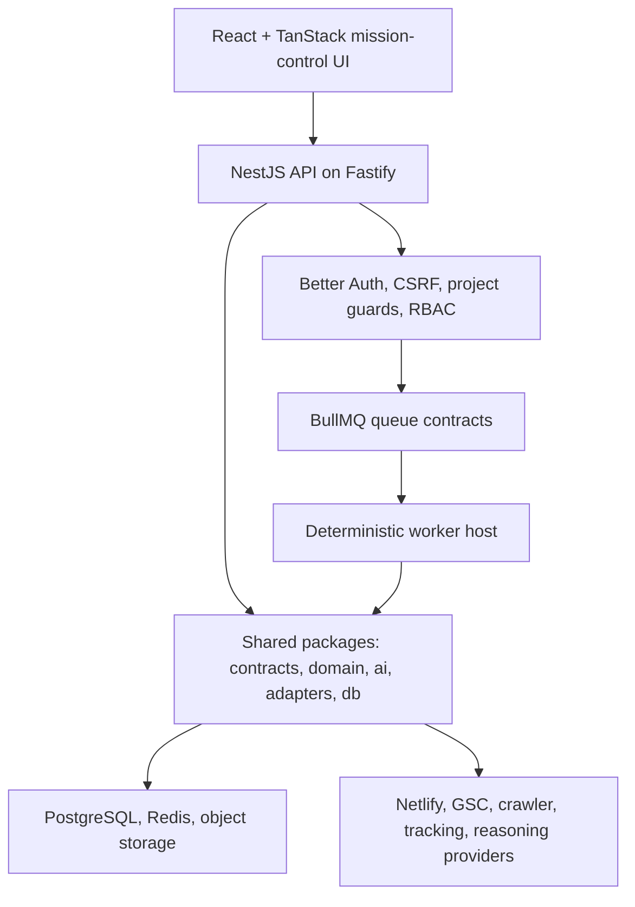
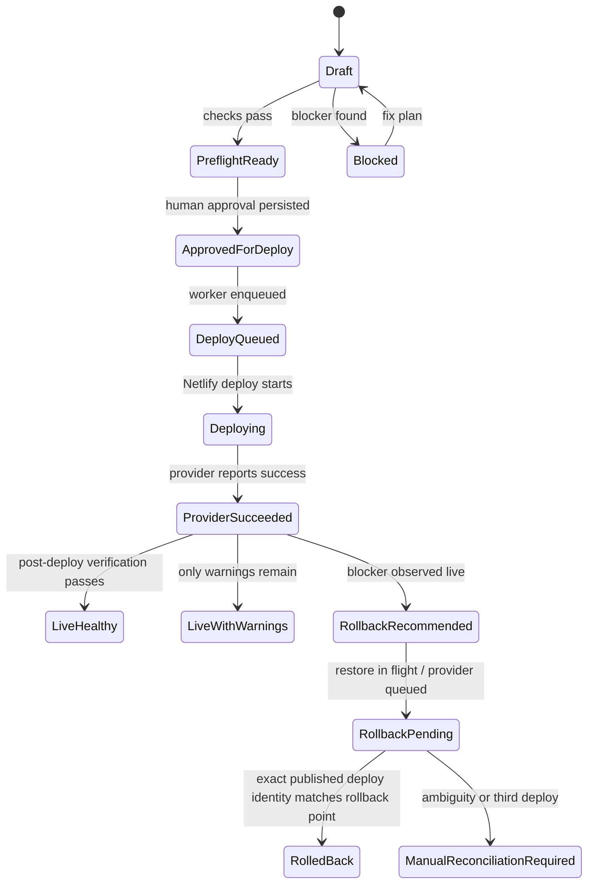
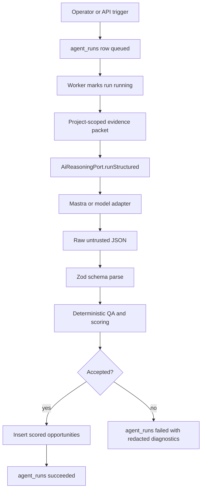
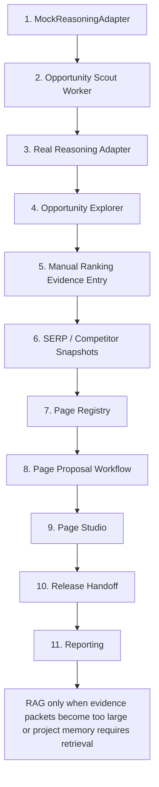
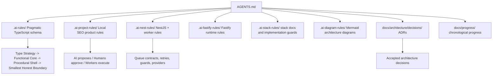

# Local SEO Mission Control

[](https://github.com/mayett515/Seo_automatisation/actions/workflows/ci.yml)

AI-assisted Local SEO platform for finding evidence-backed growth opportunities, turning approved ideas into controlled local pages, and deploying them through a verified release pipeline.

This repository is a production-minded MVP foundation. It is not a generic chatbot, a loose crawler script, or a freeform website builder. The product direction is an operational mission-control workflow for Local SEO work:

```text
Website evidence + GSC + tracking + SERP/competitor context
-> AI Opportunity Scout
-> Opportunity Explorer
-> Page proposal
-> constrained Page Studio preview
-> human approval
-> release preflight
-> deploy
-> verify
-> report only proven truth
```

## Product Rule

```text
AI scouts, reasons, drafts, and explains.
Contracts validate.
Humans approve.
Workers mutate production.
Verification decides live truth.
Reports only claim proven facts.
```

Agents never approve, deploy, roll back, mutate providers, publish sitemaps, or make customer-facing ranking claims without proof. Google Search Console is internal radar; customer-safe wins require real ranking/SERP proof or verified deployment truth.

## Why This Is Interesting

- **AI-first but controlled**: model output is untrusted JSON until it passes Zod contracts, deterministic QA, evidence resolution, and human approval.
- **Local SEO domain model**: opportunities are service-location-market hypotheses with evidence, nearby Orte, corridor logic, cannibalization risk, proof tiers, and next actions.
- **Production release spine**: releases require preflight, approval, deploy execution, post-deploy verification, rollback evidence, and exact persisted status.
- **Worker-first automation**: long-running work goes through BullMQ workers and auditable job/run ledgers instead of blocking HTTP handlers.
- **Provider isolation**: Netlify, Google Search Console, crawling/import, object storage, tracking, verification, and AI reasoning live behind purpose-named ports/adapters.
- **AI-development guardrails**: `AGENTS.md`, `.ai-rules/`, `.ai-project-rules/`, `.ai-nest-rules/`, and ADRs keep Codex/agent work aligned with the architecture.

## Architecture At A Glance

The architecture is easiest to read as a set of runtime lanes. The frontend never talks to workers or providers directly; the API owns request validation and authorization; workers own long-running effects; shared packages own contracts, domain decisions, and provider boundaries.



The codebase is a modular monolith: one API process, one worker host, and shared typed packages. Boundaries are kept explicit so the system can grow without prematurely splitting into microservices.

| Runtime lane         | Responsibility                                                                            |
| -------------------- | ----------------------------------------------------------------------------------------- |
| `apps/web`           | Operator/customer workflow UI, TanStack data loading, forms, tables, preview surfaces     |
| `apps/api`           | HTTP contracts, auth, tenant guards, queue-producing application services                 |
| `apps/worker`        | BullMQ jobs, retries, provider mutations, reconciliations, evidence-producing workflows   |
| `packages/contracts` | Shared Zod request, response, job, model-output, and product artifact contracts           |
| `packages/domain`    | Pure release, rollback, verification, report-safety, and website-import decisions         |
| `packages/ai`        | Prompt/task builders, deterministic Opportunity Scout QA gates, scoring, redaction policy |
| `packages/adapters`  | Purpose-named ports and provider adapters for Netlify, GSC, crawler, storage, reasoning   |
| `packages/db`        | Drizzle schema, migrations, persistence source of truth                                   |

## Stack

| Layer            | Stack                                                                                                          |
| ---------------- | -------------------------------------------------------------------------------------------------------------- |
| Frontend         | React, TypeScript, TanStack Router, Query, Form, Table, Store, Virtual                                         |
| API              | NestJS, Fastify, Better Auth, CSRF, project-scoped guards, RBAC                                                |
| Workers          | BullMQ, Redis, deterministic job handlers, retry/failure evidence                                              |
| AI lane          | Mastra-ready reasoning boundary, `AiReasoningPort`, OpenCode/model adapter design, structured output contracts |
| Data             | PostgreSQL, Drizzle schema/migrations, object storage artifact refs                                            |
| SEO integrations | Google OAuth, Search Console port, tracking ingestion, website import/crawl evidence                           |
| Deployment       | Netlify adapter, release preflight, post-deploy verification, rollback reconciliation                          |
| Verification     | HTTP/HTML checks, browser smoke via Playwright, GSC warning checks                                             |
| Quality          | pnpm workspace, ESLint, Prettier, TypeScript, unit/integration/browser checks, CI                              |

## Current Foundation

### Auth, Tenancy, And API Boundaries

- Better Auth integration with DB-backed session handling.
- Project membership checks for persisted customer/project data.
- Project-scoped RBAC permissions.
- CSRF protection on mutating routes.
- Project-scoped release routes such as `projects/:projectId/releases/:releasePlanId`.
- Zod request parsing at API boundaries.

### Website Import Evidence

Website import is the first evidence lane for the AI workflow. It captures own-site facts before any model proposes opportunities:

- discovered routes,
- title/meta hints,
- service and area candidates,
- brand hints,
- page evidence,
- import run status,
- explicit dry-run states when infrastructure is unavailable.

### Tracking And GSC Foundations

- Public tracking ingestion with project-scoped keys and origin checks.
- Rate-limit posture designed to fail closed for persisted production events.
- Google OAuth and Search Console integration behind `SearchConsolePort`.
- GSC signals treated as internal opportunity radar, not customer-facing proof.

### Release, Netlify, Verification, And Rollback

The release spine is intentionally conservative:



Netlify deploy success is not treated as customer-safe release success. The system requires post-deploy verification before live truth is upgraded. Rollback success is proven by exact published deploy identity, not by optimistic provider status alone.

### AI Reasoning Boundary

The AI lane is designed as a provider adapter, not as product truth:



Important invariant:

```text
Opportunities linked to an agent run may exist only when that run is succeeded.
```

The planned worker state machine supports retries without creating duplicate opportunities:

```text
queued  -> running
running -> succeeded
running -> failed
failed  -> running   # retry
succeeded is terminal
```

### Opportunity Scout Contracts

The first AI product output is an `OpportunityBrief`, not a generated page. The model can propose, but deterministic code decides what can become product state.

Core concepts already modeled:

- `EvidenceRef`
- `OpportunityBrief`
- `NearbyPlaceCandidate`
- `CorridorCluster`
- `OpportunityGroupHint`
- `agent_runs`
- `opportunities.classification`

Opportunity classifications:

| Classification     | Meaning                                           |
| ------------------ | ------------------------------------------------- |
| `proven_win`       | Customer-report safe only with real ranking proof |
| `near_term_target` | Good roadmap or page-proposal candidate           |
| `internal_radar`   | Interesting weak signal, not proof                |
| `rejected`         | Not useful or unsafe to pursue now                |

Example local SEO reasoning:

```text
Generic /entruempelung/ receives GSC impressions for "entruempelung dachau"
-> classify as internal_radar or near_term_target
-> require service fit, unique Dachau intent, SERP/competitor evidence, and cannibalization checks
-> only then propose a page brief
-> never report as a proven win without Top 10 / Top 5 / Top 3 / rank 1 proof
```

### Page Studio Direction

Page Studio is planned as "WordPress but safer and easier", not as a free drag-and-drop builder.

```text
Header        locked top
Hero          locked first
Body sections movable only inside legal zones
FAQ / AreaMap usually late body
Final CTA     locked late
Footer        locked bottom
```

Section controls are constrained:

- left/right arrows switch variants,
- up/down arrows appear only when movement is legal,
- text generation produces structured content,
- media selection is explicit,
- approval freezes one concrete version,
- release handoff uses the existing deploy/verify spine.

## AI And Worker Roadmap



Near-term coding target:

```text
evidence snapshot
-> input_ref artifact
-> agent_runs queued/running
-> AiReasoningPort.runStructured
-> Zod parse
-> deterministic QA/scoring
-> transactional opportunity persistence
-> agent_runs succeeded/failed
```

Mastra/RAG posture:

- Mastra belongs behind `AiReasoningPort`.
- The first version is one structured reasoning call, not a broad multi-agent platform.
- RAG is deferred until direct evidence packets are too large or retrieval has a clear product need.
- SERP, WebExtract, and browser tools stay read-only and must snapshot evidence before the model cites it.

## Rule-Guided Development

This repo is set up for AI-assisted development with explicit rule routing. `AGENTS.md` is the entrypoint.



Example source-of-truth split:

```text
packages/contracts  -> Zod schemas and shared payload contracts
packages/domain     -> pure business decisions
packages/adapters   -> ports and provider adapters
packages/ai         -> prompt builders, QA gates, deterministic scoring
packages/db         -> Drizzle schema and migrations
apps/api            -> Nest/Fastify controllers and application services
apps/worker         -> BullMQ handlers and deterministic production effects
```

## Repository Layout

```text
apps/
  api/       NestJS + Fastify API
  web/       React + TanStack frontend
  worker/    BullMQ worker host

packages/
  adapters/  provider ports and adapters
  ai/        reasoning QA, scoring, prompt/task builders
  contracts/ shared Zod contracts
  db/        Drizzle schema and migrations
  domain/    pure domain decisions
  seo/       SEO-specific helpers
  ui/        reusable SaaS UI components

docs/
  architecture/           design docs and roadmap
  architecture/decisions/ ADRs
  progress/               chronological implementation notes
```

## Quality Gates

CI runs the same gates expected locally:

```mermaid
flowchart TD
  subgraph Validate["Validate job"]
    Install["Install dependencies"]
    Format["Prettier format check"]
    Text["Critical text health"]
    Whitespace["Whitespace check"]
    Lint["ESLint"]
    Types["TypeScript typecheck"]
    Drift["Drizzle migration drift"]
    Build["Workspace build"]
    Unit["Unit tests"]

    Install --> Format
    Format --> Text
    Text --> Whitespace
    Whitespace --> Lint
    Lint --> Types
    Types --> Drift
    Drift --> Build
    Build --> Unit
  end

  subgraph Integration["Integration job"]
    Pg["PostgreSQL service"]
    IntegrationTests["Integration tests"]
    Pg --> IntegrationTests
  end

  subgraph Browser["Browser smoke job"]
    Playwright["Install Playwright Chromium"]
    Smoke["Browser smoke tests"]
    Playwright --> Smoke
  end
```



Local commands:

```powershell
corepack pnpm install
corepack pnpm format:check
corepack pnpm lint
corepack pnpm typecheck
corepack pnpm db:check
corepack pnpm build
corepack pnpm test
corepack pnpm test:integration
corepack pnpm test:browser
corepack pnpm check
```

## Important Docs

- [Agent-First MVP Roadmap](docs/architecture/agent-first-mvp-roadmap.md)
- [AI Reasoning Port And Opportunity Scout Contracts](docs/architecture/ai-reasoning-port-and-opportunity-scout-contracts.md)
- [Frontend UI And Page Registry](docs/architecture/frontend-ui-and-page-registry.md)
- [Page Studio Layout-Zone Editor](docs/architecture/page-studio-layout-zone-editor.md)
- [Backend Foundation Status](docs/architecture/backend-foundation-status.md)
- [Lifecycle Truth Hardening Backlog](docs/architecture/lifecycle-truth-hardening-backlog.md)
- [Architecture Decisions](docs/architecture/decisions)
- [Progress Log](docs/progress)

## Current Status

The repository has a strong foundation for an AI-assisted Local SEO MVP:

- production-minded monorepo structure,
- typed API/worker contracts,
- project/tenant boundaries,
- tracking and GSC foundations,
- website import evidence,
- release/deploy/verify/rollback truth hardening,
- AI reasoning boundary and opportunity contracts,
- roadmap for Opportunity Scout, Page Studio, and reporting.

The next product feature is the Opportunity Scout worker vertical: a real end-to-end path from evidence snapshot to validated opportunity rows.
