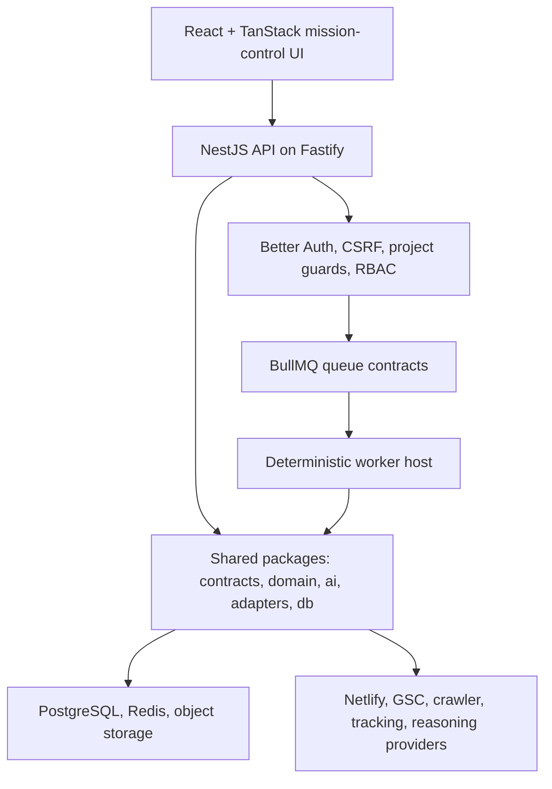
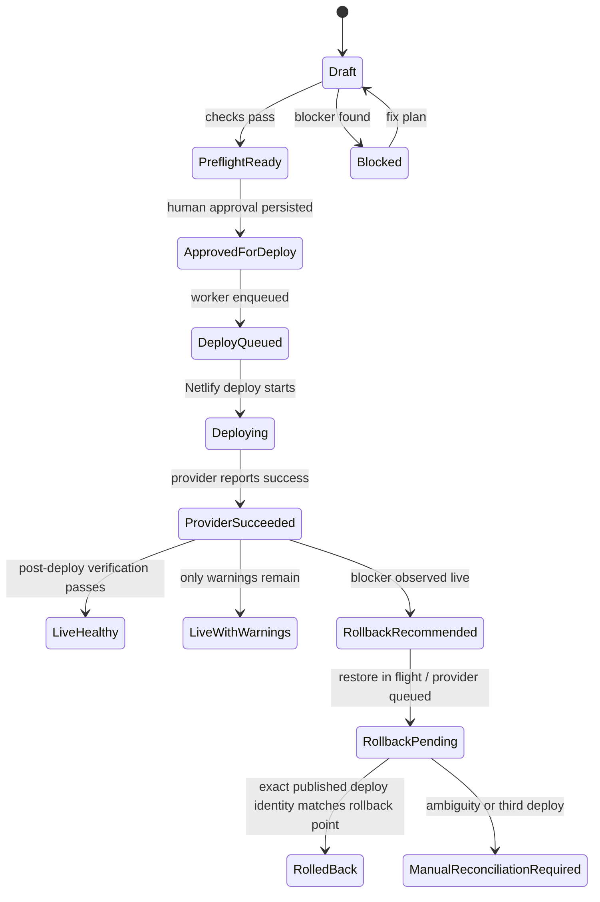
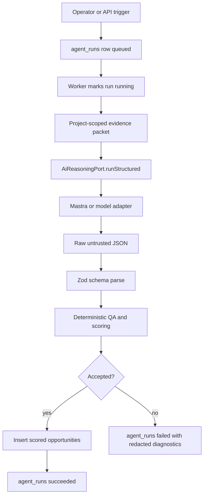
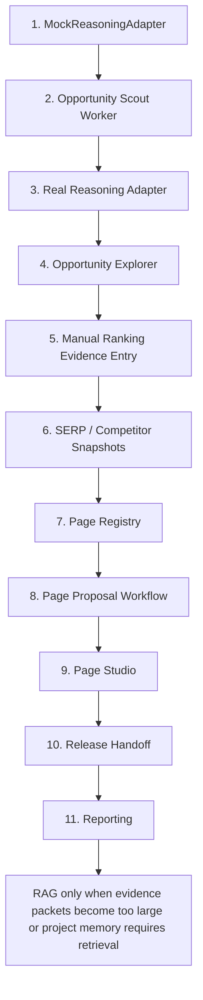
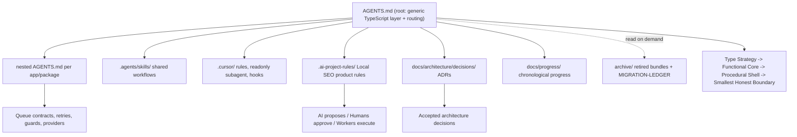

# Local SEO Mission Control

[](https://github.com/mayett515/Seo_automatisation/actions/workflows/ci.yml)

AI-assisted Local SEO platform for finding evidence-backed growth opportunities, turning approved ideas into controlled local pages, and deploying them through a verified release pipeline.

This repository is a production-minded MVP foundation. It is not a generic chatbot, a loose crawler script, or a freeform website builder. The product direction is an operational mission-control workflow for Local SEO work:

```text
Website evidence + GSC + tracking + SERP/competitor context
-> AI Opportunity Scout
-> Opportunity Explorer
-> Page proposal
-> constrained Page Studio preview
-> human approval
-> release preflight
-> deploy
-> verify
-> report only proven truth
```

## Product Rule

```text
AI scouts, reasons, drafts, and explains.
Contracts validate.
Humans approve.
Workers mutate production.
Verification decides live truth.
Reports only claim proven facts.
```

Agents never approve, deploy, roll back, mutate providers, publish sitemaps, or make customer-facing ranking claims without proof. Google Search Console is internal radar; customer-safe wins require real ranking/SERP proof or verified deployment truth.

## Why This Is Interesting

- **AI-first but controlled**: model output is untrusted JSON until it passes Zod contracts, deterministic QA, evidence resolution, and human approval.
- **Local SEO domain model**: opportunities are service-location-market hypotheses with evidence, nearby Orte, corridor logic, cannibalization risk, proof tiers, and next actions.
- **Production release spine**: releases require preflight, approval, deploy execution, post-deploy verification, rollback evidence, and exact persisted status.
- **Worker-first automation**: long-running work goes through BullMQ workers and auditable job/run ledgers instead of blocking HTTP handlers.
- **Provider isolation**: Netlify, Google Search Console, crawling/import, object storage, tracking, verification, and AI reasoning live behind purpose-named ports/adapters.
- **AI-development guardrails**: root and nested `AGENTS.md`, shared `.agents/skills/`, Cursor rules/hooks under `.cursor/`, `.ai-project-rules/`, and ADRs keep agent work aligned with the architecture (retired bundles: `archive/`).

## Architecture At A Glance

The architecture is easiest to read as a set of runtime lanes. The frontend never talks to workers or providers directly; the API owns request validation and authorization; workers own long-running effects; shared packages own contracts, domain decisions, and provider boundaries.


```mermaid
flowchart TD
  Browser["React + TanStack mission-control UI"]
  API["NestJS API on Fastify"]
  Auth["Better Auth, CSRF, project guards, RBAC"]
  Queue["BullMQ queue contracts"]
  Worker["Deterministic worker host"]
  Packages["Shared packages: contracts, domain, ai, adapters, db"]
  Data["PostgreSQL, Redis, object storage"]
  Providers["Netlify, GSC, crawler, tracking, reasoning providers"]

  Browser --> API
  API --> Auth
  Auth --> Queue
  Queue --> Worker
  API --> Packages
  Worker --> Packages
  Packages --> Data
  Packages --> Providers
```

The codebase is a modular monolith: one API process, one worker host, and shared typed packages. Boundaries are kept explicit so the system can grow without prematurely splitting into microservices.

| Runtime lane             | Responsibility                                                                                       |
| ------------------------ | ---------------------------------------------------------------------------------------------------- |
| `apps/web`               | Operator/customer workflow UI, TanStack data loading, forms, tables, and preview surfaces            |
| `apps/api`               | HTTP contracts, auth, tenant guards, and queue-producing application services                        |
| `apps/worker`            | BullMQ jobs, retries, provider mutations, reconciliation, recovery, and maintenance workflows        |
| `packages/contracts`     | Shared Zod request, response, job, model-output, and product-artifact contracts                      |
| `packages/domain`        | Pure page-editing, release, rollback, verification, recovery, and retention decisions                |
| `packages/ai`            | Prompt/QA code plus the purpose-named Opportunity Research Mastra runtime and DeepSeek model gateway |
| `packages/adapters`      | Legacy generic reasoning, hosting, GSC, crawling, storage, and other infrastructure ports/adapters   |
| `packages/config`        | Runtime configuration contracts and fail-closed environment parsing                                  |
| `packages/db`            | Drizzle schema, migrations, and persistence source of truth                                          |
| `packages/page-registry` | Deployable section schemas, editor metadata, PageJson validation, and deterministic rendering        |
| `packages/seo`           | Deterministic SEO checks, release facts, and customer-report safety guards                           |
| `packages/ui`            | Reusable operator-application UI primitives                                                          |

## Stack

| Layer            | Stack                                                                                                                   |
| ---------------- | ----------------------------------------------------------------------------------------------------------------------- |
| Frontend         | React, TypeScript, TanStack Router, Query, Form, Table, Store, Virtual                                                  |
| API              | NestJS, Fastify, Better Auth, CSRF, project-scoped guards, RBAC                                                         |
| Workers          | BullMQ, Redis, deterministic job handlers, retry/failure evidence                                                       |
| AI lane          | Constrained `AiReasoningPort` lanes plus the ADR 0022 DeepSeek/Mastra Opportunity Research workflow and evidence ledger |
| Data             | PostgreSQL, Drizzle schema/migrations, object storage artifact refs                                                     |
| SEO integrations | Google OAuth, Search Console port, tracking ingestion, website import/crawl evidence                                    |
| Deployment       | Netlify adapter, release preflight, post-deploy verification, rollback reconciliation                                   |
| Verification     | HTTP/HTML checks, browser smoke via Playwright, GSC warning checks                                                      |
| Quality          | pnpm workspace, ESLint, Prettier, TypeScript, unit/integration/browser checks, CI                                       |

## Current Foundation

### Auth, Tenancy, And API Boundaries

- Better Auth integration with DB-backed session handling.
- Project membership checks for persisted customer/project data.
- Project-scoped RBAC permissions.
- CSRF protection on mutating routes.
- Project-scoped release routes such as `projects/:projectId/releases/:releasePlanId`.
- Zod request parsing at API boundaries.

### Website Import Evidence

Website import is the first evidence lane for the AI workflow. It captures own-site facts before any model proposes opportunities:

- discovered routes,
- title/meta hints,
- service and area candidates,
- brand hints,
- page evidence,
- import run status,
- explicit dry-run states when infrastructure is unavailable.

### Tracking And GSC Foundations

- Public tracking ingestion with project-scoped keys and origin checks.
- Rate-limit posture designed to fail closed for persisted production events.
- Google OAuth and Search Console integration behind `SearchConsolePort`.
- GSC signals treated as internal opportunity radar, not customer-facing proof.

### Release, Netlify, Verification, And Rollback

The release spine is intentionally conservative:


```mermaid
stateDiagram-v2
  [*] --> Draft
  Draft --> PreflightReady: checks pass
  Draft --> Blocked: blocker found
  PreflightReady --> ApprovedForDeploy: human approval persisted
  ApprovedForDeploy --> DeployQueued: worker enqueued
  DeployQueued --> Deploying: Netlify deploy starts
  Deploying --> ProviderSucceeded: provider reports success
  ProviderSucceeded --> LiveHealthy: post-deploy verification passes
  ProviderSucceeded --> LiveWithWarnings: only warnings remain
  ProviderSucceeded --> RollbackRecommended: blocker observed live
  RollbackRecommended --> RollbackPending: restore in flight / provider queued
  RollbackPending --> RolledBack: exact published deploy identity matches rollback point
  RollbackPending --> ManualReconciliationRequired: ambiguity or third deploy
  Blocked --> Draft: fix plan
```

Netlify deploy success is not treated as customer-safe release success. The system requires post-deploy verification before live truth is upgraded. Rollback success is proven by exact published deploy identity, not by optimistic provider status alone.

### AI Reasoning Boundary

The AI lane is designed as a provider adapter, not as product truth:


```mermaid
flowchart TD
  Trigger["Operator or API trigger"]
  RunQueued["agent_runs row queued"]
  WorkerRunning["Worker marks run running"]
  EvidencePacket["Project-scoped evidence packet"]
  PortCall["AiReasoningPort.runStructured"]
  Adapter["Mastra or model adapter"]
  RawJson["Raw untrusted JSON"]
  Parse["Zod schema parse"]
  QA["Deterministic QA and scoring"]
  Decision{"Accepted?"}
  Persist["Insert scored opportunities"]
  Succeeded["agent_runs succeeded"]
  Failed["agent_runs failed with redacted diagnostics"]

  Trigger --> RunQueued
  RunQueued --> WorkerRunning
  WorkerRunning --> EvidencePacket
  EvidencePacket --> PortCall
  PortCall --> Adapter
  Adapter --> RawJson
  RawJson --> Parse
  Parse --> QA
  QA --> Decision
  Decision -->|yes| Persist
  Persist --> Succeeded
  Decision -->|no| Failed
```

Important invariant:

```text
Opportunities linked to an agent run may exist only when that run is succeeded.
```

The durable worker state machine supports retries without creating duplicate opportunities:

```text
queued  -> running
running -> succeeded
running -> failed
failed  -> running   # retry
succeeded is terminal
```

### Legacy Opportunity Scout Contracts

This section records the bounded single-call lane that remains supported behind `AiReasoningPort`. ADR 0022's implemented Opportunity Research workflow is the current multi-step DeepSeek/Mastra research path and does not reinterpret these historical contracts as V2 truth.

The first AI product output is an `OpportunityBrief`, not a generated page. The model can propose, but deterministic code decides what can become product state.

Core concepts already modeled:

- `EvidenceRef`
- `OpportunityBrief`
- `NearbyPlaceCandidate`
- `CorridorCluster`
- `OpportunityGroupHint`
- `agent_runs`
- `opportunities.classification`

Opportunity classifications:

| Classification     | Meaning                                           |
| ------------------ | ------------------------------------------------- |
| `proven_win`       | Customer-report safe only with real ranking proof |
| `near_term_target` | Good roadmap or page-proposal candidate           |
| `internal_radar`   | Interesting weak signal, not proof                |
| `rejected`         | Not useful or unsafe to pursue now                |

Example local SEO reasoning:

```text
Generic /entruempelung/ receives GSC impressions for "entruempelung dachau"
-> classify as internal_radar or near_term_target
-> require service fit, unique Dachau intent, SERP/competitor evidence, and cannibalization checks
-> only then propose a page brief
-> never report as a proven win without Top 10 / Top 5 / Top 3 / rank 1 proof
```

### Page Studio Direction

Page Studio implements the "WordPress but safer and easier" direction as a constrained, append-only editor rather than a free drag-and-drop builder.

```text
Header        locked top
Hero          locked first
Body sections movable only inside legal zones
FAQ / AreaMap usually late body
Final CTA     locked late
Footer        locked bottom
```

Section controls are constrained:

- left/right arrows switch variants,
- up/down arrows appear only when movement is legal,
- text generation produces structured content,
- media selection is explicit,
- approval freezes one concrete version,
- release handoff uses the existing deploy/verify spine.

The current baseline includes registry-owned prop controls, legal movement and variants, explicit section replacement, bounded AI copy suggestions, project-scoped media placement, version-scoped notes, durable approval, and release handoff. Richer section families and theme controls remain incremental additions to the same command boundary.

## AI And Worker Roadmap


```mermaid
flowchart TD
  A["1. MockReasoningAdapter"] --> B["2. Opportunity Scout Worker"]
  B --> C["3. Real Reasoning Adapter"]
  C --> D["4. Opportunity Explorer"]
  D --> E["5. Manual Ranking Evidence Entry"]
  E --> F["6. SERP / Competitor Snapshots"]
  F --> G["7. Page Registry"]
  G --> H["8. Page Proposal Workflow"]
  H --> I["9. Page Studio"]
  I --> J["10. Release Handoff"]
  J --> K["11. Reporting"]
  K --> L["RAG only when evidence packets become too large or project memory requires retrieval"]
```

Steps 1 through 11 are implemented at MVP-baseline depth. The customer-safe Report and Next Action milestone now has its first useful fact-only vertical:

```text
strict report contracts, canonicalization, eligibility, lifecycle, and permissions (implemented)
-> stable issue/run/version/provenance aggregate and review CAS (implemented)
-> deterministic report evidence snapshot (implemented)
-> customer-safe fact eligibility and exact evidence references (implemented)
-> deterministic fact-only draft (implemented)
-> optional bounded report_narrative headings/transitions (implemented)
-> deterministic claim and narrative validation (implemented)
-> digest-bound human review and stored private HTML (implemented)
-> digest-bound human publication and correction (implemented)
-> authenticated report list/review/publication/history UI (implemented)
-> allowlisted navigation Next Actions (snapshot descriptors and UI handoff implemented)
-> consequential typed command offers only after target CAS hardening
```

Mastra/RAG posture:

- Existing bounded calls remain behind `AiReasoningPort`; the first multi-step runtime uses a purpose-named Mastra workflow adapter.
- ADR 0022 keeps source evidence, agent execution, and product result truth separate.
- Mastra snapshots and traces are operational data; PostgreSQL owns run claims, evidence identity, recovery, approval, and product results.
- Direct DeepSeek plus one bounded Opportunity Research workflow is implemented as persisted research-plan, follow-up-capture, and strategy steps.
- PostgreSQL execution epochs and exact-owner heartbeats fence late step, event, search-capture, success, and failure writes; recovery consumes one exact stored follow-up plan and recovery generation.
- Succeeded checkpoints retain application-canonical bytes plus SHA-256, and replay recomputes both before reuse.
- Production model context includes only current approved, task-scoped, explicitly model-allowed knowledge; retirement preserves history while removing current/model selection.
- An obvious-secret egress gate runs before DeepSeek transport, and promotion evidence binds workflow, policy, prompt, fixture-corpus, and model identity.
- The credentialed DeepSeek provider smoke remains an operational gate.
- RAG is deferred until direct evidence packets are too large or retrieval has a clear product need.
- The shipped public discovery tool is the purpose-owned DuckDuckGo HTML adapter; it stores bounded `research_support_only` captures before the model may cite them. Generic page reading, browser acting, authenticated browsing, and broad MCP/web-tool catalogs remain unavailable.

## Rule-Guided Development

This repo is set up for AI-assisted development with explicit rule routing. `AGENTS.md` is the entrypoint.


```mermaid
flowchart TD
  AGENTS["AGENTS.md (root: generic TypeScript layer + routing)"] --> Nested["nested AGENTS.md per app/package"]
  AGENTS --> Skills[".agents/skills/ shared workflows"]
  AGENTS --> CursorL[".cursor/ rules, readonly subagent, hooks"]
  AGENTS --> Product[".ai-project-rules/ Local SEO product rules"]
  AGENTS --> ADR["docs/architecture/decisions/ ADRs"]
  AGENTS --> Progress["docs/progress/ chronological progress"]
  AGENTS -. read on demand .-> Archive["archive/ retired bundles + MIGRATION-LEDGER"]

  AGENTS --> Boundary["Type Strategy -> Functional Core -> Procedural Shell -> Smallest Honest Boundary"]
  Product --> Control["AI proposes / Humans approve / Workers execute"]
  Nested --> Jobs["Queue contracts, retries, guards, providers"]
  ADR --> Decisions["Accepted architecture decisions"]
```

Example source-of-truth split:

```text
packages/contracts  -> Zod schemas and shared payload contracts
packages/domain     -> pure business decisions
packages/adapters   -> ports and provider adapters
packages/ai         -> prompt builders, QA gates, deterministic scoring
packages/config     -> environment contracts and runtime configuration
packages/db         -> Drizzle schema and migrations
packages/page-registry -> customer-page schemas, editor metadata, and static rendering
packages/seo        -> SEO checks, release facts, and report-safety validation
packages/ui         -> operator-app UI primitives
apps/api            -> Nest/Fastify controllers and application services
apps/worker         -> BullMQ handlers and deterministic production effects
```

## Repository Layout

```text
apps/
  api/       NestJS + Fastify API
  web/       React + TanStack frontend
  worker/    BullMQ worker host

packages/
  adapters/  provider ports and adapters
  ai/        reasoning QA, scoring, prompt/task builders
  config/    environment contracts and runtime configuration
  contracts/ shared Zod contracts
  db/        Drizzle schema and migrations
  domain/    pure domain decisions
  page-registry/ customer-page schemas, editor metadata, and static renderer
  seo/       SEO-specific helpers
  ui/        reusable SaaS UI components

docs/
  architecture/           design docs and roadmap
  architecture/decisions/ ADRs
  progress/               chronological implementation notes
```

## Quality Gates

CI runs the same gates expected locally:


```mermaid
flowchart TD
  subgraph Validate["Validate job"]
    Install["Install dependencies"]
    Format["Prettier format check"]
    Text["Critical text health"]
    Whitespace["Whitespace check"]
    Lint["ESLint"]
    Types["TypeScript typecheck"]
    Drift["Drizzle migration drift"]
    Build["Workspace build"]
    Unit["Unit tests"]

    Install --> Format
    Format --> Text
    Text --> Whitespace
    Whitespace --> Lint
    Lint --> Types
    Types --> Drift
    Drift --> Build
    Build --> Unit
  end

  subgraph Integration["Integration job"]
    Pg["PostgreSQL service"]
    IntegrationTests["Integration tests"]
    Pg --> IntegrationTests
  end

  subgraph Browser["Browser smoke job"]
    Playwright["Install Playwright Chromium"]
    Smoke["Browser smoke tests"]
    Playwright --> Smoke
  end
```

Local commands:

```powershell
corepack pnpm install
corepack pnpm format:check
corepack pnpm lint
corepack pnpm typecheck
corepack pnpm db:check
corepack pnpm build
corepack pnpm test
corepack pnpm test:integration
corepack pnpm test:browser
corepack pnpm check
```

## Important Docs

- [Agent-First MVP Roadmap](docs/architecture/agent-first-mvp-roadmap.md)
- [AI Reasoning Port And Opportunity Scout Contracts](docs/architecture/ai-reasoning-port-and-opportunity-scout-contracts.md)
- [Frontend UI And Page Registry](docs/architecture/frontend-ui-and-page-registry.md)
- [Page Studio Layout-Zone Editor](docs/architecture/page-studio-layout-zone-editor.md)
- [Backend Foundation Status](docs/architecture/backend-foundation-status.md)
- [Lifecycle Truth Hardening Backlog](docs/architecture/lifecycle-truth-hardening-backlog.md)
- [Architecture Decisions](docs/architecture/decisions)
- [Progress Log](docs/progress)

## Current Status

The repository has a strong foundation for an AI-assisted Local SEO MVP:

- production-minded monorepo structure,
- typed API/worker contracts,
- project/tenant boundaries,
- tracking and GSC foundations,
- website import evidence,
- Opportunity Scout, Explorer, ranking-proof, SERP, and technical-audit baselines,
- ADR 0022 Opportunity Research with confirmed project context, approved PostgreSQL Markdown knowledge, direct DeepSeek/Mastra orchestration, bounded DuckDuckGo capture, exact citations, recovery, and operator timelines,
- typed PageJson, deterministic Page Registry rendering, and append-only Page Studio editing,
- bounded AI page/copy proposal workflows with human-owned application and approval,
- project-scoped media upload, processing, preview/deploy parity, placement, and physical cleanup,
- release/deploy/verify/rollback truth hardening,
- DB-before-queue recovery for seven registered safe/idempotent page, media, report, verification, and Opportunity Research lanes,
- AI reasoning boundaries and named task policies.

The controlled page lane now runs from evidence-backed opportunity through proposal, versioned editing, media-aware preview, durable approval, release planning, deploy, verification, rollback, and bounded cleanup. The customer-safe Report and Next Action milestone now includes ADR 0021 Slices 0-6: strict snapshot/provenance contracts, deterministic fact-only assembly, optional bounded report-scoped AI headings/transitions with fact-only fallback, digest-bound review, immutable reviewed HTML, actor-backed render retry, source-serialized publication/correction, correction alerts, authenticated snapshot-owned reads, and the report list/detail/review/publication/history workspace. The useful report vertical remains complete without AI; command offers, PDF, RAG, public links, and direct prose editing remain optional later work.
