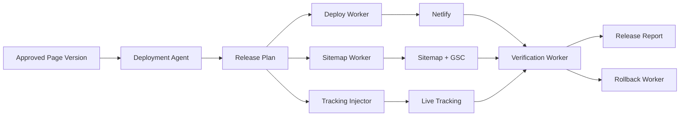

# Deployment Agent Architecture

The Deployment Agent is a coordinator and evaluator. It does not perform low-level deployment itself.
The low-level deployment is handled by deterministic workers.

## Architecture principle

```text
Agent = reasoning, explanation, risk, release plan.
Worker = deterministic execution.
```

## Components

```text
Deployment Agent
- reads approved page versions
- reads customer notes and approvals
- evaluates release readiness
- creates release plan
- explains risk and blockers
- creates release notes
- triggers deploy workers

Deploy Worker
- builds static/React assets
- calls Netlify APIs
- attaches subdomains/routes
- stores deployment result

Sitemap Worker
- updates sitemap.xml
- validates live sitemap
- submits sitemap when connected

Tracking Injector
- injects project tracking IDs
- ensures phone/WhatsApp/form/map events exist
- prevents tracking on blocked staging URLs

Verification Worker
- checks HTTP status
- checks canonical and robots
- checks schema presence
- checks sitemap inclusion
- checks tracking events loaded
- checks core route health

Rollback Worker
- restores previous stable deployment
- reverts sitemap when needed
- marks release as rolled back
```

## Boundary diagram



## Release readiness states

```text
READY
No blockers. Warnings are acceptable.

READY_WITH_WARNINGS
Deploy possible, but the customer should understand the risk.

BLOCKED
Deployment must not run until blockers are resolved.

DEPLOYING
The deterministic deployment pipeline is running.

LIVE_HEALTHY
Post-deploy checks passed.

LIVE_WITH_WARNINGS
Live but not ideal; monitoring or follow-up recommended.

ROLLBACK_RECOMMENDED
Deployment created a serious issue.

ROLLED_BACK
Previous stable version restored.
```

## Hard separation

The Deployment Agent can create a deploy recommendation.
The customer approval system owns approval.
The Deploy Worker owns execution.
The Verification Worker owns live health checks.
The Report Agent owns performance impact interpretation after data exists.

## Data flow

```text
page_version.approved
→ deployment_agent.preflight
→ release_plan.created
→ deploy_job.queued
→ netlify_deploy.completed
→ verification.completed
→ release_report.created
→ monitoring_window.started
```
