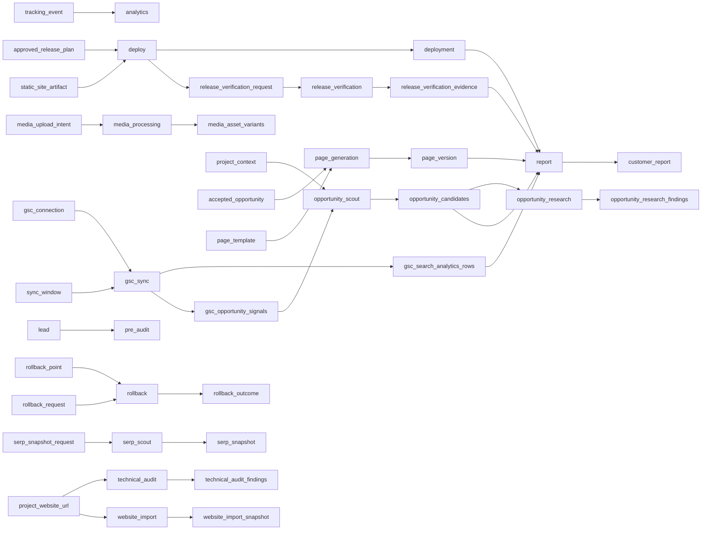

# Lane map (generated)

Do not edit. Regenerate with `corepack pnpm exec tsx tools/check-lane-inventory.ts --write`.
This file answers "what exists and in what state"; the reason for each state lives in the leaf.

## evidence

| Lane | State | Consumes | Produces | Missing |
| --- | --- | --- | --- | --- |
| `analytics` | scaffold | tracking-event | - | 2 |
| `gsc-sync` | built | gsc-connection, sync-window | gsc-search-analytics-rows, gsc-opportunity-signals | - |
| `serp-scout` | partial | serp-snapshot-request | serp-snapshot | 1 |
| `technical-audit` | built | project-website-url | technical-audit-findings | - |

## intake

| Lane | State | Consumes | Produces | Missing |
| --- | --- | --- | --- | --- |
| `pre-audit` | scaffold | lead | - | 6 |

## notification

| Lane | State | Consumes | Produces | Missing |
| --- | --- | --- | --- | --- |
| `notifications` | scaffold | - | - | 2 |

## opportunity

| Lane | State | Consumes | Produces | Missing |
| --- | --- | --- | --- | --- |
| `local-analysis` | scaffold | - | - | 2 |
| `opportunity-research` | built | opportunity-candidates | opportunity-research-findings | - |
| `opportunity-scout` | built | project-context, gsc-opportunity-signals | opportunity-candidates | - |

## page

| Lane | State | Consumes | Produces | Missing |
| --- | --- | --- | --- | --- |
| `media-processing` | built | media-upload-intent | media-asset-variants | - |
| `page-generation` | built | accepted-opportunity, page-template | page-version | - |
| `seo-qa` | scaffold | - | - | 2 |

## release

| Lane | State | Consumes | Produces | Missing |
| --- | --- | --- | --- | --- |
| `deploy` | built | approved-release-plan, static-site-artifact | deployment, release-verification-request | - |
| `release-verification` | built | release-verification-request | release-verification-evidence | - |
| `rollback` | built | rollback-point, rollback-request | rollback-outcome | - |

## report

| Lane | State | Consumes | Produces | Missing |
| --- | --- | --- | --- | --- |
| `report` | partial | gsc-search-analytics-rows, deployment, release-verification-evidence, page-version, opportunity-candidates | customer-report | 1 |

## website

| Lane | State | Consumes | Produces | Missing |
| --- | --- | --- | --- | --- |
| `website-import` | partial | project-website-url | website-import-snapshot | 1 |

## Flow

