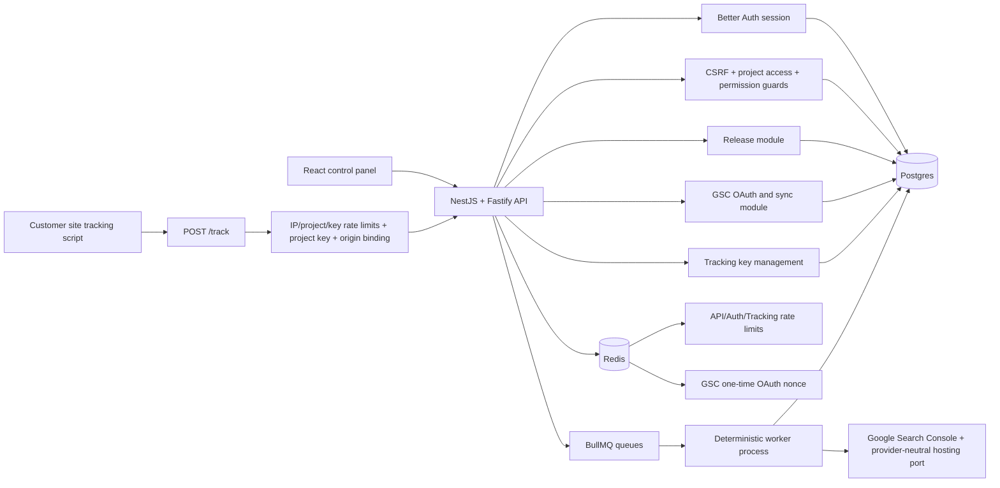
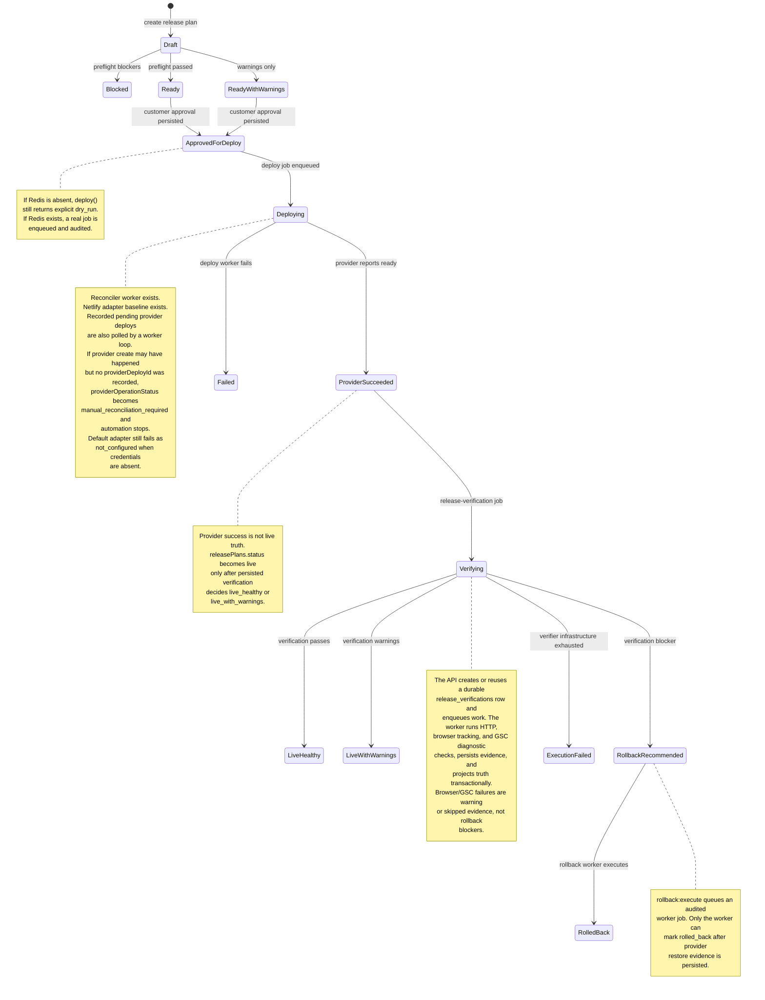

# Backend Foundation Status

Current baseline: after deploy provider-operation hardening, release-verification workerization, typed PageJson/Page Registry validation, static rendering migration, lifecycle integration coverage, and the rollback restore execution baseline.

This page records what the backend foundation now enforces, what is still intentionally incomplete, and where the next serious foundation items sit on the roadmap.

## Current Foundation



How to read this: the API owns request authorization and persistence. The public tracking endpoint is not session guarded; its boundary is project-scoped publishable key plus allowed origin plus route-specific rate limiting. Workers execute queued side effects and now update `job_runs`.

## Finished

| Area                      | Status                          | What is enforced                                                                                                                                                                                                                                                                                                                                                                                                                                                                                                                                                                                                                                                                                                                                                                                                                                                                                                                                                                                                                                                                                                                                                                                                                                                                                                                                                                                                                                                                                                                                                                                                                                                                                                                                                                                                                                                                                                                                                                                                                                                                                                                               |
| ------------------------- | ------------------------------- | ---------------------------------------------------------------------------------------------------------------------------------------------------------------------------------------------------------------------------------------------------------------------------------------------------------------------------------------------------------------------------------------------------------------------------------------------------------------------------------------------------------------------------------------------------------------------------------------------------------------------------------------------------------------------------------------------------------------------------------------------------------------------------------------------------------------------------------------------------------------------------------------------------------------------------------------------------------------------------------------------------------------------------------------------------------------------------------------------------------------------------------------------------------------------------------------------------------------------------------------------------------------------------------------------------------------------------------------------------------------------------------------------------------------------------------------------------------------------------------------------------------------------------------------------------------------------------------------------------------------------------------------------------------------------------------------------------------------------------------------------------------------------------------------------------------------------------------------------------------------------------------------------------------------------------------------------------------------------------------------------------------------------------------------------------------------------------------------------------------------------------------------------- |
| Auth/session              | Finished foundation             | Better Auth owns sessions, sessions are DB-durable, Fastify mounts `/api/auth/*`, Nest guards consume session context.                                                                                                                                                                                                                                                                                                                                                                                                                                                                                                                                                                                                                                                                                                                                                                                                                                                                                                                                                                                                                                                                                                                                                                                                                                                                                                                                                                                                                                                                                                                                                                                                                                                                                                                                                                                                                                                                                                                                                                                                                         |
| Tenant authorization      | Finished foundation             | Project access resolves before permissions; owner/admin/editor/viewer roles gate privileged actions.                                                                                                                                                                                                                                                                                                                                                                                                                                                                                                                                                                                                                                                                                                                                                                                                                                                                                                                                                                                                                                                                                                                                                                                                                                                                                                                                                                                                                                                                                                                                                                                                                                                                                                                                                                                                                                                                                                                                                                                                                                           |
| CSRF                      | Finished foundation             | Unsafe authenticated routes are Origin/Referer guarded outside local/test fallback.                                                                                                                                                                                                                                                                                                                                                                                                                                                                                                                                                                                                                                                                                                                                                                                                                                                                                                                                                                                                                                                                                                                                                                                                                                                                                                                                                                                                                                                                                                                                                                                                                                                                                                                                                                                                                                                                                                                                                                                                                                                            |
| GSC OAuth                 | Finished foundation             | Signed state, PKCE, Redis `GETDEL` nonce, session re-check, project access re-check, encrypted token storage, safe redirect.                                                                                                                                                                                                                                                                                                                                                                                                                                                                                                                                                                                                                                                                                                                                                                                                                                                                                                                                                                                                                                                                                                                                                                                                                                                                                                                                                                                                                                                                                                                                                                                                                                                                                                                                                                                                                                                                                                                                                                                                                   |
| GSC sync worker           | Finished baseline               | GSC sync runs decrypt the project-scoped refresh token, refresh Google access, query Search Analytics through the Search Console port, replace prior rows for the sync run, derive internal opportunity signals, mark sync completion, and update connection sync state. Decrypt failure, invalid refresh tokens, transient refresh failures, and Search Console query failures are classified separately. Reconnect-required failures mark the connection `error` and are terminal to BullMQ retries; transient/query failures leave it connected but visible through `failureJson`. Real Postgres integration tests prove successful import, empty-result cleanup, decrypt failure, invalid refresh-token failure, transient refresh failure, and Search Console query failure persistence without live Google network calls.                                                                                                                                                                                                                                                                                                                                                                                                                                                                                                                                                                                                                                                                                                                                                                                                                                                                                                                                                                                                                                                                                                                                                                                                                                                                                                                |
| DB ownership              | Finished foundation             | API process uses a shared `DatabaseService` and an executable no-rogue-pool guard.                                                                                                                                                                                                                                                                                                                                                                                                                                                                                                                                                                                                                                                                                                                                                                                                                                                                                                                                                                                                                                                                                                                                                                                                                                                                                                                                                                                                                                                                                                                                                                                                                                                                                                                                                                                                                                                                                                                                                                                                                                                             |
| Redis ownership           | Finished foundation             | API process uses shared error-handled Redis for rate limits/OAuth state/Better Auth secondary storage.                                                                                                                                                                                                                                                                                                                                                                                                                                                                                                                                                                                                                                                                                                                                                                                                                                                                                                                                                                                                                                                                                                                                                                                                                                                                                                                                                                                                                                                                                                                                                                                                                                                                                                                                                                                                                                                                                                                                                                                                                                         |
| Proxy/rate-limit topology | Finished foundation             | Broad `TRUST_PROXY=true` is rejected in production; Redis-backed rate limits are wired. Accepted-event/write-protection tracking buckets fail closed in strict production posture when Redis is unavailable; pre-validation buckets remain soft throttles that may degrade locally. Redis rate-limit increments use one Lua operation so new buckets cannot be created without their TTL.                                                                                                                                                                                                                                                                                                                                                                                                                                                                                                                                                                                                                                                                                                                                                                                                                                                                                                                                                                                                                                                                                                                                                                                                                                                                                                                                                                                                                                                                                                                                                                                                                                                                                                                                                      |
| Tracking ingestion        | Finished pre-MVP foundation     | Per-project publishable keys, hashed storage, create/list/revoke API, owner/admin management, allowed-origin binding, `/track` IP, IP/project, true project, key, and key/project rate limits, explicit dry-run vs persisted result. Persisted accepted events require the write-protection rate-limit path instead of silently accepting when Redis-backed limits are unavailable in production posture.                                                                                                                                                                                                                                                                                                                                                                                                                                                                                                                                                                                                                                                                                                                                                                                                                                                                                                                                                                                                                                                                                                                                                                                                                                                                                                                                                                                                                                                                                                                                                                                                                                                                                                                                      |
| Release preflight         | Finished pre-MVP foundation     | Preflight reads persisted evidence and fails closed for missing approval, noindex, or local SEO blockers. Rollback evidence is required after a prior successful deploy; first deploys are allowed because there is no prior safe rollback source to snapshot. When a provider-backed prior deployment exists, preflight prepares a rollback point before evaluating `rollback_point_ready`, preferring verified-good sources (`live_healthy`, `live_with_warnings`) and falling back to `provider_succeeded` only when no verified-good source exists. Known-bad or unknown-health deployments (`rollback_recommended`, `verifying`, `failed`) are not rollback sources. Duplicate preparation for the same release/source identity is conflict-suppressed at the database boundary. Placeholder rollback rows without provider deploy evidence do not satisfy the gate. QA warnings and tracking readiness are warning-level.                                                                                                                                                                                                                                                                                                                                                                                                                                                                                                                                                                                                                                                                                                                                                                                                                                                                                                                                                                                                                                                                                                                                                                                                                |
| Worker audit lifecycle    | Finished baseline               | Producers create `job_runs` before enqueue, use a DB unique key on stable BullMQ job ID + queue name, coalesce only active/waiting BullMQ jobs, archive terminal audit rows before legitimate re-enqueue, workers prefer `jobRunId` payloads, and jobs mark running, retrying, completed, or failed for real BullMQ jobs. Terminal worker errors are rethrown to BullMQ as unrecoverable failures.                                                                                                                                                                                                                                                                                                                                                                                                                                                                                                                                                                                                                                                                                                                                                                                                                                                                                                                                                                                                                                                                                                                                                                                                                                                                                                                                                                                                                                                                                                                                                                                                                                                                                                                                             |
| Deploy/verify prep        | Finished prep                   | `deployments.deployment_key`, deployment evidence JSON, expanded provider-neutral `SiteHostingPort`, and `release_verification_checks` exist for the deterministic deploy/verifier slices. Migration 0009 backfills existing deployment rows before enforcing `NOT NULL`.                                                                                                                                                                                                                                                                                                                                                                                                                                                                                                                                                                                                                                                                                                                                                                                                                                                                                                                                                                                                                                                                                                                                                                                                                                                                                                                                                                                                                                                                                                                                                                                                                                                                                                                                                                                                                                                                      |
| Deploy reconciler worker  | Finished baseline               | `deploy()` enqueues real deploy jobs when Redis exists. The worker reloads persisted plan/check/approval/rollback/page-version/hosting evidence, writes or reuses a deployment ledger row by `deployment_key`, writes an approved release artifact, marks provider mutation intent, persists provider IDs and upload resume evidence before file upload, records local upload completion after file upload, and runs a periodic reconciliation loop for recorded pending provider deploys. Its rollback-evidence guard uses the same safe prior-deployment status set as API preflight, and stale deploy replays for bad/unknown-health rows do not project the release back to `live`. Transient provider failures stay retryable; pending provider states stay reconcilable; provider-backed upload/read uncertainty stays reconcilable even after final attempts; explicit provider terminal failed/rolled-back snapshots mark failure immediately and stop retries. Unexpected local reconciler errors are surfaced instead of being silently counted as pending. Unknown provider-create outcomes are marked `manual_reconciliation_required` instead of being mislabeled as ordinary failed deploys.                                                                                                                                                                                                                                                                                                                                                                                                                                                                                                                                                                                                                                                                                                                                                                                                                                                                                                                                     |
| Hosting adapter           | Baseline wired                  | The worker composition root now wires a Netlify digest-deploy adapter when `NETLIFY_AUTH_TOKEN` is present and otherwise keeps the safe `not_configured` adapter. The Netlify adapter exposes phased `beginDeploy` and `uploadDeployFiles` operations, creates an async SHA1 digest deploy with a traceable title, polls until Netlify exposes required file digests, returns an opaque upload resume token, uploads required files as `application/octet-stream`, and returns `ready` only for provider-ready/live state. Netlify and Google Search Console provider HTTP failures are timeout-bounded and throw safe typed provider errors, so raw provider response bodies do not become long-lived job/deployment/sync audit evidence. Production workers use S3-backed `ObjectStoragePort`; local/test workers use filesystem storage.                                                                                                                                                                                                                                                                                                                                                                                                                                                                                                                                                                                                                                                                                                                                                                                                                                                                                                                                                                                                                                                                                                                                                                                                                                                                                                    |
| Post-deploy verification  | Workerized Browser/GSC baseline | `verify()` now loads a provider-succeeded deployment only far enough to create or reuse a durable `release_verifications.status = running` row, then enqueues `release-verification` with `jobId = verificationId`. A partial unique Postgres index allows at most one running verification per deployment, and enqueue failure marks the pre-created row `execution_failed` with a queue check so no ghost active run remains. The worker derives intended live routes from the preferred stable production URL and release plan item routes, rejects absolute/protocol-relative target routes before fetching, runs the deterministic HTTP verifier, persists child `release_verification_checks`, and projects deployment/release truth transactionally from the persisted checks. Verifier infrastructure failures retry through BullMQ first and persist as `execution_failed` only on the final attempt, without marking the deployment or release plan as observed failed health. The HTTP verifier follows redirects manually and rejects redirect hops that leave the deployment origin for both page and sitemap fetches. The baseline checks HTTP success, noindex, canonical URL, title/meta description, primary H1, JSON-LD parseability, local SEO schema types, exact sitemap `<loc>` inclusion, tracking marker presence, and browser-observed tracking requests when tracking is configured. Browser launch/timeouts/runtime failures become skipped warning evidence, not rollback blockers. GSC post-deploy handoff is worker-owned and appends warning-level evidence for connection readiness, sitemap submission, and bounded URL Inspection diagnostics; GSC OAuth failures may mark the connection `error`, but GSC indexing diagnostics do not create rollback recommendations. Live-route, browser, and GSC inspection fan-out are bounded. `releasePlans.status` is only a coarse release-level projection; an observed verification failure maps it to `failed` so UI/reporting cannot overclaim `live`, but the exact reason lives in `deployments`, `release_verifications`, and `release_verification_checks`. |
| Rollback execution        | Baseline reconciled             | `rollback:execute` authorizes and scopes a persisted rollback point with provider deploy evidence, pins the current rollback-target deployment into the job payload, queues a `rollback` BullMQ job, and records queue audit truth without mutating release success state in the API. Rollback points are baseline-prepared by release preflight from the strongest safe prior deployment source available: verified-good first, provider-succeeded fallback, never rollback-recommended/verifying/failed. The rollback worker reloads project/release/rollback-point/pinned-deployment/hosting evidence, writes `restore_in_flight` intent before provider restore, calls the provider-neutral hosting rollback operation once, and only marks `deployments.status` plus `releasePlans.status` as `rolled_back` after provider rollback completion is persisted. Provider `queued` restore responses now write queryable `deployments.status = "rollback_pending"` evidence. The periodic rollback reconciler reads provider-published deploy identity through the hosting port and completes the same guarded success transaction only when the intended restore deploy is currently published. Provider read failures and still-published target deployments stay pending; third-deploy identity mismatches or malformed evidence move to manual reconciliation instead of overclaiming success. A duplicate reconciler that loses to the same completed operation is counted as `staleNoop` and does not overwrite terminal success evidence.                                                                                                                                                                                                                                                                                                                                                                                                                                                                                                                                                                                              |
| Frontend auth UX          | Finished baseline               | Login/sign-up/sign-out, session gate, credentialed API fetches, explicit local scaffold bypass.                                                                                                                                                                                                                                                                                                                                                                                                                                                                                                                                                                                                                                                                                                                                                                                                                                                                                                                                                                                                                                                                                                                                                                                                                                                                                                                                                                                                                                                                                                                                                                                                                                                                                                                                                                                                                                                                                                                                                                                                                                                |
| AI opportunity scout      | Finished backend baseline       | The AI reasoning boundary now exposes `AiReasoningPort.runStructured` with provider/model metadata treated as audit-only information. Opportunity Scout contracts model evidence refs, nearby Orte/corridors, group hints, classifications, proof tiers, missing evidence, and recommended actions. The worker baseline loads project-scoped website import, GSC, tracking, existing-route, and open-opportunity evidence; stores a stable redacted input packet; calls the reasoning port once; Zod-parses untrusted output; runs deterministic QA/scoring; and persists opportunities plus `agent_runs` truth transactionally. The API exposes `POST /projects/:id/opportunity-scout/runs`, creates `agent_runs` as `queued`, and enqueues BullMQ with `jobId = runId`. The worker composition root defaults to `MockReasoningAdapter`; `OpenCodeGoReasoningAdapter` is available only through explicit `AI_REASONING_PROVIDER=opencode_go` configuration and remains behind the same port. Mastra orchestration, SERP/browser tools, RAG, and UI remain deferred.                                                                                                                                                                                                                                                                                                                                                                                                                                                                                                                                                                                                                                                                                                                                                                                                                                                                                                                                                                                                                                                                           |
| Mastra slot               | Reserved baseline               | `@localseo/ai` contains workflow/agent descriptors, but Mastra/OpenCode provider orchestration is not product-integrated yet. The accepted path is provider adapter first, then richer Mastra workflow/agent internals later without leaking provider types into contracts, DB, UI, controllers, or product truth.                                                                                                                                                                                                                                                                                                                                                                                                                                                                                                                                                                                                                                                                                                                                                                                                                                                                                                                                                                                                                                                                                                                                                                                                                                                                                                                                                                                                                                                                                                                                                                                                                                                                                                                                                                                                                             |

## Release Flow State



How to read this: the preflight, approval, deploy enqueue, deploy worker, release-verification worker, rollback point preparation, and rollback execution state transitions are now real enough to trust as backend control flow. Productive hosting has a Netlify adapter baseline, approved structural artifact handoff, rendered static-site artifact handoff, async required-file upload handling, persisted provider IDs before upload, recorded provider-deploy and provider-rollback reconcilers, persisted post-deploy verification evidence, source-filtered and duplicate-guarded preflight rollback points, provider-native rollback restore, browser tracking smoke checks, and GSC sitemap/URL Inspection handoff. Provider success is only provider truth; live release truth is projected after persisted verification. It is still not customer-facing production-complete because rollback trigger policy is manual-only for MVP by ADR 0014, the tiny provider-create window before provider ID persistence still escalates to manual reconciliation rather than automatic lookup, non-rendering release actions still need directive-artifact policy before broad use, and future UI/reporting still needs to read detailed lifecycle evidence instead of coarse status alone.

Important UI/reporting interpretation: `releasePlans.status = "failed"` is a coarse "do not present this release as healthy/live" projection. It can mean the provider deploy failed, or it can mean the provider deploy succeeded but post-deploy verification found a blocker and wrote `deployments.status = "rollback_recommended"` or `deployments.verificationStatus = "failed"`. UI, reports, release notes, and customer-facing explanations must read the deployment and verification detail rows before explaining why a release is failed or rollback-recommended.

## Next Serious Foundation Items

### 1. Rollback And Restore Follow-Up

Meaning: deepen the newly wired rollback baseline from "execute a known rollback point" into a complete restore lifecycle.

High-value items:

- Keep rollback reconciliation read-only against provider restore mutations; do not repeat the restore mutation just to poll.
- Add richer release-plan or release-health states if UI needs to distinguish provider failure, verification failure, rollback recommended, rollback pending, and rolled back.
- Keep rollback execution manual/operator-triggered for MVP per ADR 0014.
- Treat automatic rollback as a future per-project opt-in feature only after verified-good-source, debounce, single-flight, circuit-breaker, audit, notification, and no-loop gates exist.
- Keep rollback execution deterministic; Mastra/AI may explain or recommend but must not mutate provider state.

### 2. Foundation Integration Coverage Depth

Meaning: the main lifecycle integration milestone is wired. Continue filling the documented edges that remain useful before production.

High-value items:

- Worker-side `job_runs` lifecycle patches across real retry and terminal worker errors.
- Queue producer partial-failure behavior when Redis and Postgres disagree.
- HTTP/controller-level tracking ingestion tests for header extraction and guard ordering.
- GSC sync retry behavior proving worker retry state and `job_runs` lifecycle remain aligned.
- Login/session browser smoke for unauthenticated redirect, sign-in, protected route access, and sign-out.

### 3. Lifecycle Truth Hardening

Meaning: apply the accepted review findings that cut across deploy, verification, rollback, and reporting truth.

High-value items:

- Keep verifier execution failure separate from observed live-page verification failure; `execution_failed` is infrastructure truth, not page-health truth.
- Keep absolute/protocol-relative release target URLs rejected before verification can fetch outside the deployment host, and keep HTTP verifier redirects same-origin per hop.
- Plan a future split of coarse `releasePlans.status` into clearer approval/deploy/health/rollback projections when UI/reporting needs precise lifecycle explanation.
- Keep the deploy state-machine idea incremental; extract decision helpers and tests before any structural migration.

Reference: [Lifecycle Truth Hardening Backlog](lifecycle-truth-hardening-backlog.md).

### 4. Productive Hosting Follow-Up

Meaning: keep the newly wired Netlify adapter/artifact handoff production-operable as verification and integration tests land. This work still must not rely on AI reasoning during execution.

Required behavior:

- Keep `SiteHostingPort` provider-neutral; Netlify details stay inside the adapter.
- Keep production artifact storage on durable object storage (`S3_BUCKET`); keep filesystem storage local/test only.
- Keep the approved release artifact writer and provider adapter on the shared `ObjectStoragePort`.
- Keep Netlify async digest deploys in the poll-until-required-digests flow before file upload.
- Keep deploy jobs on the longer fixed retry window so provider-ready polling has real time to complete.
- Keep the periodic reconciler for deployments that already have `providerDeployId` recorded.
- Keep upload resume controlled by local upload-complete evidence, not provider-neutral `deploying` state.
- Publish only approved page versions.
- Inject/verify the project tracking snippet only from approved tracking config.
- Continue to validate rollback artifacts before productive mutation.
- Preserve deployment ledger idempotency by `deployment_key`.
- Keep provider-operation state typed and guarded; `manual_reconciliation_required` must stop automation and must not be overwritten back to `in_flight`.
- Keep the provider mutation in-flight marker fail-closed: a retry must not create another provider deploy when a provider call may have succeeded but no provider deploy id was recorded.
- If Netlify exposes a reliable provider-side idempotency or metadata lookup path later, replace manual reconciliation with automatic provider lookup only when the match is exact, time-windowed, state-filtered, and non-ambiguous.
- Keep `ready` deploy results limited to provider-ready/live state; accepted, uploaded, queued, or building provider states must remain pending and be reconciled with `getDeploy`.
- Keep default `not_configured` behavior for environments without provider credentials.
- Keep HTTP-first verification as the baseline and add browser-level script checks only when HTTP/HTML evidence is insufficient.

Definition of done:

```text
approved_for_deploy + passing checks
-> queued deploy job
-> deterministic worker reloads persisted evidence
-> provider adapter executes hosting mutation
-> deployment row has providerDeployId/liveUrl
-> release status reflects provider side effect
-> retry after provider-created crash either resumes from recorded providerDeployId or stops at manual_reconciliation_required instead of creating a duplicate provider deploy
-> verify endpoint persists live evidence and updates deployment health
```

## Mastra Reasoning And Creative Assembly Lane

Mastra is a first-class product lane, but it is not the production side-effect authority.

```mermaid
flowchart LR
  Import[Website import and field facts] --> Facts[Structured brand, service, area, design facts]
  Facts --> Mastra[Mastra reasoning workflows and agents]
  Mastra --> Proposal[Structured proposals]

  Proposal --> Contracts[Zod output contracts]
  Contracts --> Registry[Component registry and prop schemas]
  Registry --> QA[Deterministic SEO/design QA]
  QA --> Preview[Preview and edit UI]
  Preview --> Approval[Human/customer approval]
  Approval --> Release[Release preflight]
  Release --> Worker[Deterministic deploy worker]

  Mastra -. never directly deploys .-> Worker
```



How to read this: Mastra proposes strategy, content, layout, and design choices. Contracts, registries, deterministic QA, preview, approval, and workers decide what is valid and what is allowed to mutate production.

### Mastra Lane Status

The corrected MVP roadmap is agent-first: website import, GSC, tracking, SERP, competitor, and field evidence feed an AI Opportunity Scout, then the platform validates and previews controlled proposals. See [Agent-First MVP Roadmap](agent-first-mvp-roadmap.md) and [Page Studio Layout-Zone Editor](page-studio-layout-zone-editor.md).

| Slice                             | Status          | Purpose                                                                                                                                                                                                                                                                          |
| --------------------------------- | --------------- | -------------------------------------------------------------------------------------------------------------------------------------------------------------------------------------------------------------------------------------------------------------------------------- |
| AI reasoning port                 | Done            | `AiReasoningPort.runStructured` exists in `packages/adapters`; contracts own tasks/failure codes; the worker calls it behind the Opportunity Scout.                                                                                                                              |
| Website understanding workflow    | Planned         | Convert imported website evidence into structured business, service, area, tone, color, layout, and CTA facts.                                                                                                                                                                   |
| Opportunity scout workflow        | Backend         | Worker/API baseline uses website, GSC, tracking, existing-route, and open-opportunity evidence to persist validated OpportunityBriefs.                                                                                                                                           |
| Component registry                | Baseline        | `packages/page-registry` defines the first Local SEO section set, strict prop schemas, registry validation, SEO fact derivation, release-action robots resolution, and static rendering/CSS ownership.                                                                           |
| Page proposal workflow            | Backend + UI    | The `page_brief_draft` worker produces validated draft proposals and preview versions; Opportunity Explorer can queue runs and read subject-scoped run status. Release-plan handoff remains planned.                                                                             |
| Page Studio                       | Domain + review | Pure movement/composition helpers exist for required sections, singleton counts, legal ordering, movement, variants, replacement, and publish-readiness. The Pages preview surface now supports section notes and durable approve/request-changes decisions.                     |
| Validation pipeline               | Partial         | Opportunity Scout output already passes Zod, evidence resolution, proof containment, duplicate/cannibalization gates, and deterministic scoring. PageJson now passes contract safety, registry prop validation, and page-studio composition checks before it becomes deployable. |
| Preview and approval UI           | Baseline        | Pages renders API-produced sandboxed preview HTML, records section notes, blocks approval on unresolved approval blockers with DB-backed serialization against concurrent blocker creation, and writes durable approval/request-changes audit rows. Full Page Studio editing remains planned. |
| Release/report narrative workflow | Planned         | Draft release notes and customer-safe report language; deterministic guards block forbidden proof claims.                                                                                                                                                                        |

### Mastra Can Suggest

- competitor observations and SERP positioning,
- opportunity classifications and page brief candidates,
- main-domain and subdomain/local-page structure,
- service/area page strategy,
- page hierarchy and internal links,
- component/section composition,
- copy for main-domain and local pages,
- title/meta/schema/FAQ/CTA drafts,
- design tone, colors, and theme hints from the imported website,
- release explanations,
- customer-safe report narrative.

### Mastra Must Not Own

- customer approval,
- release status truth,
- deploy execution,
- rollback execution,
- live health verification,
- direct provider/hosting mutations,
- unvalidated arbitrary frontend code generation.

Preferred output shape:

```text
website facts
-> Mastra structured proposal
-> schema/component validation
-> deterministic QA
-> preview
-> approval
-> release/deploy/verify
```

The key implementation rule is: Mastra outputs structured proposals, not arbitrary React/site code strings.

## Backend Foundation Readiness

Programming-wise, the backend foundation is set for continued product build and architecture review. The core security and tenancy surfaces are no longer scaffolding:

- session identity is real,
- tenant authorization is real,
- GSC OAuth is real,
- tracking ingestion has a real boundary,
- release preflight is evidence-backed,
- DB/Redis ownership is consolidated,
- worker jobs have baseline lifecycle audit.

It is not yet set for fully automated customer-facing production deploys. The deploy reconciler worker, release-verification worker, rollback reconciler worker, approved-artifact and static-site-artifact handoff, durable production artifact storage, Netlify adapter baseline, typed provider-operation state, manual reconciliation stop state, HTTP/browser/GSC verification baseline, lifecycle integration coverage baseline, typed PageJson/Page Registry validation, static renderer baseline, and manual-only MVP rollback trigger policy now exist. Future automatic rollback opt-in gates, richer lifecycle UI/reporting projections, non-rendering action directive artifacts, and the remaining recovery polish items are still deferred by ADR/backlog trigger. The Mastra creative assembly lane is also not product-integrated yet; it is planned as the proposal layer for site strategy, copy, layout, and design, not as an execution bypass. Until customer-facing UI/reporting consumes detailed verification/rollback evidence and the remaining recovery paths are exercised in production-like infrastructure, deploy success and live health must not be treated as broad customer-safe production facts.

## Pattern Mining Checkpoint

A targeted pattern-mining run was recorded in `.ai-stealer-findings/2026-06-29-backend-deploy-verification-patterns.md`. The useful research question was narrow:

```text
How do production TypeScript web apps wire:
- Next.js or React frontends,
- Fastify or Nest/Fastify APIs,
- queue workers,
- DB-backed audit/status rows,
- deploy/release verification flows,
- public browser tracking keys,
- Mastra-style reasoning workflows that produce structured site/content/layout proposals?
```

Best sources are likely official docs and close production repos, not broad big-data catalogs. The strongest comparison targets are apps with:

- a React/Next.js control plane,
- an API/worker split,
- provider adapters,
- job audit tables,
- deployment or publishing flows,
- public ingestion keys or webhook-style trust boundaries.
- AI/agent proposal workflows separated from deterministic execution.

The goal was not to reopen product decisions. The goal was to validate the remaining foundation items before implementing deploy, verification, and the Mastra proposal pipeline.
