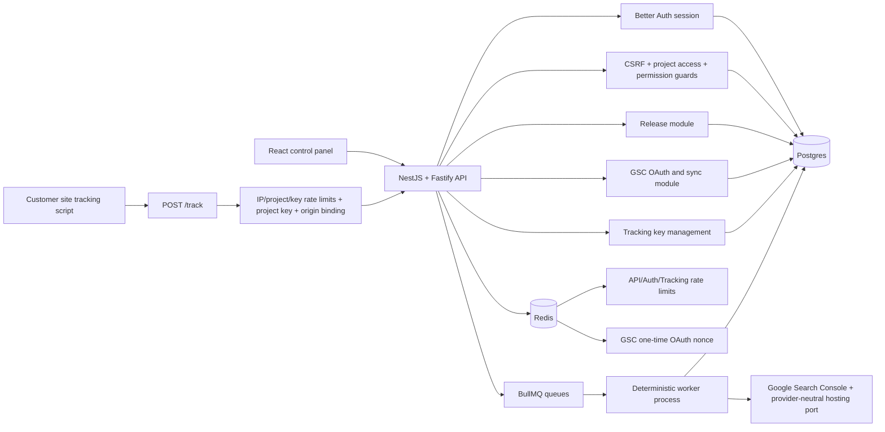
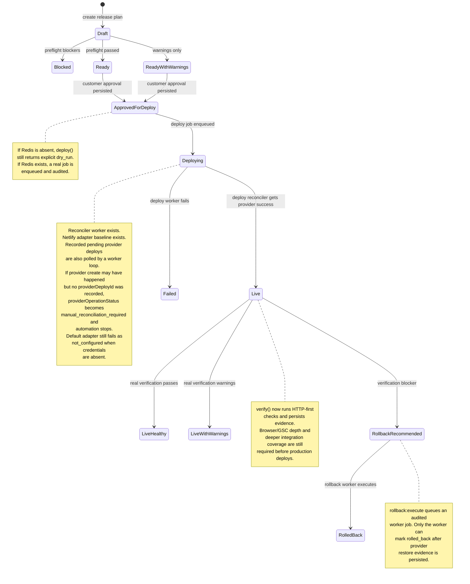

# Backend Foundation Status

Current baseline: after deploy provider-operation hardening, HTTP-first post-deploy verification, lifecycle integration coverage, and the rollback restore execution baseline.

This page records what the backend foundation now enforces, what is still intentionally incomplete, and where the next serious foundation items sit on the roadmap.

## Current Foundation



How to read this: the API owns request authorization and persistence. The public tracking endpoint is not session guarded; its boundary is project-scoped publishable key plus allowed origin plus route-specific rate limiting. Workers execute queued side effects and now update `job_runs`.

## Finished

| Area                      | Status                      | What is enforced                                                                                                                                                                                                                                                                                                                                                                                                                                                                                                                                                                                                                                                                                                                                                                                                                                                                                                                                                                                                                                                                                                                                                                                         |
| ------------------------- | --------------------------- | -------------------------------------------------------------------------------------------------------------------------------------------------------------------------------------------------------------------------------------------------------------------------------------------------------------------------------------------------------------------------------------------------------------------------------------------------------------------------------------------------------------------------------------------------------------------------------------------------------------------------------------------------------------------------------------------------------------------------------------------------------------------------------------------------------------------------------------------------------------------------------------------------------------------------------------------------------------------------------------------------------------------------------------------------------------------------------------------------------------------------------------------------------------------------------------------------------- |
| Auth/session              | Finished foundation         | Better Auth owns sessions, sessions are DB-durable, Fastify mounts `/api/auth/*`, Nest guards consume session context.                                                                                                                                                                                                                                                                                                                                                                                                                                                                                                                                                                                                                                                                                                                                                                                                                                                                                                                                                                                                                                                                                   |
| Tenant authorization      | Finished foundation         | Project access resolves before permissions; owner/admin/editor/viewer roles gate privileged actions.                                                                                                                                                                                                                                                                                                                                                                                                                                                                                                                                                                                                                                                                                                                                                                                                                                                                                                                                                                                                                                                                                                     |
| CSRF                      | Finished foundation         | Unsafe authenticated routes are Origin/Referer guarded outside local/test fallback.                                                                                                                                                                                                                                                                                                                                                                                                                                                                                                                                                                                                                                                                                                                                                                                                                                                                                                                                                                                                                                                                                                                      |
| GSC OAuth                 | Finished foundation         | Signed state, PKCE, Redis `GETDEL` nonce, session re-check, project access re-check, encrypted token storage, safe redirect.                                                                                                                                                                                                                                                                                                                                                                                                                                                                                                                                                                                                                                                                                                                                                                                                                                                                                                                                                                                                                                                                             |
| GSC sync worker           | Finished baseline           | GSC sync runs decrypt the project-scoped refresh token, refresh Google access, query Search Analytics through the Search Console port, replace prior rows for the sync run, derive internal opportunity signals, mark sync completion, and update connection sync state. Real Postgres integration tests now prove successful import, empty-result cleanup, and Search Console query failure persistence without live Google network calls.                                                                                                                                                                                                                                                                                                                                                                                                                                                                                                                                                                                                                                                                                                                                                              |
| DB ownership              | Finished foundation         | API process uses a shared `DatabaseService` and an executable no-rogue-pool guard.                                                                                                                                                                                                                                                                                                                                                                                                                                                                                                                                                                                                                                                                                                                                                                                                                                                                                                                                                                                                                                                                                                                       |
| Redis ownership           | Finished foundation         | API process uses shared error-handled Redis for rate limits/OAuth state/Better Auth secondary storage.                                                                                                                                                                                                                                                                                                                                                                                                                                                                                                                                                                                                                                                                                                                                                                                                                                                                                                                                                                                                                                                                                                   |
| Proxy/rate-limit topology | Finished foundation         | Broad `TRUST_PROXY=true` is rejected in production; Redis-backed rate limits are wired.                                                                                                                                                                                                                                                                                                                                                                                                                                                                                                                                                                                                                                                                                                                                                                                                                                                                                                                                                                                                                                                                                                                  |
| Tracking ingestion        | Finished pre-MVP foundation | Per-project publishable keys, hashed storage, create/list/revoke API, owner/admin management, allowed-origin binding, `/track` IP, IP/project, true project, key, and key/project rate limits, explicit dry-run vs persisted result.                                                                                                                                                                                                                                                                                                                                                                                                                                                                                                                                                                                                                                                                                                                                                                                                                                                                                                                                                                     |
| Release preflight         | Finished pre-MVP foundation | Preflight reads persisted evidence and fails closed for missing approval, noindex, or local SEO blockers. Rollback evidence is required after a prior successful deploy; first deploys are allowed because there is no prior live deployment to snapshot. When a provider-backed prior deployment exists, preflight now prepares a rollback point for the new release before evaluating `rollback_point_ready`; placeholder rollback rows without provider deploy evidence do not satisfy the gate. QA warnings and tracking readiness are warning-level.                                                                                                                                                                                                                                                                                                                                                                                                                                                                                                                                                                                                                                                |
| Worker audit lifecycle    | Finished baseline           | Producers create `job_runs` before enqueue, use a DB unique key on stable BullMQ job ID + queue name, coalesce only active/waiting BullMQ jobs, archive terminal audit rows before legitimate re-enqueue, workers prefer `jobRunId` payloads, and jobs mark running, retrying, completed, or failed for real BullMQ jobs. Terminal worker errors are rethrown to BullMQ as unrecoverable failures.                                                                                                                                                                                                                                                                                                                                                                                                                                                                                                                                                                                                                                                                                                                                                                                                       |
| Deploy/verify prep        | Finished prep               | `deployments.deployment_key`, deployment evidence JSON, expanded provider-neutral `SiteHostingPort`, and `release_verification_checks` exist for the deterministic deploy/verifier slices. Migration 0009 backfills existing deployment rows before enforcing `NOT NULL`.                                                                                                                                                                                                                                                                                                                                                                                                                                                                                                                                                                                                                                                                                                                                                                                                                                                                                                                                |
| Deploy reconciler worker  | Finished baseline           | `deploy()` enqueues real deploy jobs when Redis exists. The worker reloads persisted plan/check/approval/rollback/page-version/hosting evidence, writes or reuses a deployment ledger row by `deployment_key`, writes an approved release artifact, marks provider mutation intent, persists provider IDs and upload resume evidence before file upload, records local upload completion after file upload, and runs a periodic reconciliation loop for recorded pending provider deploys. Transient provider failures stay retryable; pending provider states stay reconcilable; unknown provider-create outcomes are marked `manual_reconciliation_required` instead of being mislabeled as ordinary failed deploys.                                                                                                                                                                                                                                                                                                                                                                                                                                                                                   |
| Hosting adapter           | Baseline wired              | The worker composition root now wires a Netlify digest-deploy adapter when `NETLIFY_AUTH_TOKEN` is present and otherwise keeps the safe `not_configured` adapter. The Netlify adapter exposes phased `beginDeploy` and `uploadDeployFiles` operations, creates an async SHA1 digest deploy with a traceable title, polls until Netlify exposes required file digests, returns an opaque upload resume token, uploads required files as `application/octet-stream`, and returns `ready` only for provider-ready/live state. Production workers use S3-backed `ObjectStoragePort`; local/test workers use filesystem storage.                                                                                                                                                                                                                                                                                                                                                                                                                                                                                                                                                                              |
| Post-deploy verification  | Baseline wired              | `verify()` now loads a provider-succeeded deployment, derives intended live routes from the preferred stable production URL and release plan item routes, rejects absolute/protocol-relative target routes before fetching, runs a deterministic HTTP verifier, persists `release_verifications` plus child `release_verification_checks`, and updates deployment verification/health status from observed evidence. Verifier infrastructure failures persist as `execution_failed` without marking the deployment or release plan as observed failed health. The baseline checks HTTP success, noindex, canonical URL, JSON-LD parseability, exact sitemap `<loc>` inclusion, and tracking marker presence when tracking is configured. The renderer emits approved canonical and JSON-LD fields so the baseline deploy artifact and verifier agree. `releasePlans.status` is only a coarse release-level projection; an observed verification failure maps it to `failed` so UI/reporting cannot overclaim `live`, but the exact reason lives in `deployments`, `release_verifications`, and `release_verification_checks`. Browser-level checks and GSC handoff remain follow-up work.                |
| Rollback execution        | Baseline wired              | `rollback:execute` authorizes and scopes a persisted rollback point with provider deploy evidence, pins the current rollback-target deployment into the job payload, queues a `rollback` BullMQ job, and records queue audit truth without mutating release success state in the API. Rollback points are baseline-prepared by release preflight from the latest provider-backed prior deployment when one exists. The rollback worker reloads project/release/rollback-point/pinned-deployment/hosting evidence, calls the provider-neutral hosting rollback operation, and only marks `deployments.status` plus `releasePlans.status` as `rolled_back` after provider rollback completion is persisted. Netlify rollback uses the provider restore endpoint inside the adapter and treats Netlify `current` restore responses as completed. Provider failures, pending restore responses, stale deployment/release-plan states, and missing rollback evidence do not overclaim success; rollback execution evidence is stored on rollback points and deployment evidence JSON with provider-neutral result status, provider deploy ids, live URL, and adapter evidence for later reconciliation/audit. |
| Frontend auth UX          | Finished baseline           | Login/sign-up/sign-out, session gate, credentialed API fetches, explicit local scaffold bypass.                                                                                                                                                                                                                                                                                                                                                                                                                                                                                                                                                                                                                                                                                                                                                                                                                                                                                                                                                                                                                                                                                                          |
| Mastra slot               | Reserved baseline           | `@localseo/ai` contains workflow/agent descriptors, but the product workflows for site planning and creative assembly are not integrated yet and are not loaded by the worker.                                                                                                                                                                                                                                                                                                                                                                                                                                                                                                                                                                                                                                                                                                                                                                                                                                                                                                                                                                                                                           |

## Release Flow State



How to read this: the preflight, approval, deploy enqueue, deploy worker, HTTP-first verification, rollback point preparation, and rollback execution state transitions are now real enough to trust as backend control flow. Productive hosting has a Netlify adapter baseline, approved-artifact handoff, async required-file upload handling, persisted provider IDs before upload, a recorded-pending-deploy reconciler, persisted post-deploy verification evidence, preflight-prepared rollback points, and a provider-native rollback restore baseline. It is still not production-complete because browser-level tracking/script checks are not wired, GSC handoff is not wired, rollback pending reconciliation depth is still baseline-level, and the tiny provider-create window before provider ID persistence still escalates to manual reconciliation rather than automatic lookup.

Important UI/reporting interpretation: `releasePlans.status = "failed"` is a coarse "do not present this release as healthy/live" projection. It can mean the provider deploy failed, or it can mean the provider deploy succeeded but post-deploy verification found a blocker and wrote `deployments.status = "rollback_recommended"` or `deployments.verificationStatus = "failed"`. UI, reports, release notes, and customer-facing explanations must read the deployment and verification detail rows before explaining why a release is failed or rollback-recommended.

## Next Serious Foundation Items

### 1. Rollback And Restore Follow-Up

Meaning: deepen the newly wired rollback baseline from "execute a known rollback point" into a complete restore lifecycle.

High-value items:

- Deepen rollback point selection once lifecycle states split provider success from verified live health; the current baseline prepares a point from the latest provider-backed restorable deployment during preflight.
- Add rollback job reconciliation for provider rollback states that return queued/pending instead of completed; do not repeat the restore mutation just to poll.
- Add richer release-plan or release-health states if UI needs to distinguish provider failure, verification failure, rollback recommended, rollback pending, and rolled back.
- Decide whether rollback execution is automatic after `rollback_recommended` or requires a human/operator trigger for MVP.
- Keep rollback execution deterministic; Mastra/AI may explain or recommend but must not mutate provider state.

### 2. Foundation Integration Coverage Depth

Meaning: the main lifecycle integration milestone is wired. Continue filling the documented edges that remain useful before production.

High-value items:

- Worker-side `job_runs` lifecycle patches across real retry and terminal worker errors.
- Queue producer partial-failure behavior when Redis and Postgres disagree.
- HTTP/controller-level tracking ingestion tests for header extraction and guard ordering.
- GSC sync retry behavior proving worker retry state and `job_runs` lifecycle remain aligned.
- Login/session browser smoke for unauthenticated redirect, sign-in, protected route access, and sign-out.

### 3. Lifecycle Truth Hardening

Meaning: apply the accepted review findings that cut across deploy, verification, rollback, and reporting truth.

High-value items:

- Keep verifier execution failure separate from observed live-page verification failure; `execution_failed` is infrastructure truth, not page-health truth.
- Keep absolute/protocol-relative release target URLs rejected before verification can fetch outside the deployment host.
- Plan a future split of coarse `releasePlans.status` into clearer approval/deploy/health/rollback projections when UI/reporting needs precise lifecycle explanation.
- Keep the deploy state-machine idea incremental; extract decision helpers and tests before any structural migration.

Reference: [Lifecycle Truth Hardening Backlog](lifecycle-truth-hardening-backlog.md).

### 4. Productive Hosting Follow-Up

Meaning: keep the newly wired Netlify adapter/artifact handoff production-operable as verification and integration tests land. This work still must not rely on AI reasoning during execution.

Required behavior:

- Keep `SiteHostingPort` provider-neutral; Netlify details stay inside the adapter.
- Keep production artifact storage on durable object storage (`S3_BUCKET`); keep filesystem storage local/test only.
- Keep the approved release artifact writer and provider adapter on the shared `ObjectStoragePort`.
- Keep Netlify async digest deploys in the poll-until-required-digests flow before file upload.
- Keep deploy jobs on the longer fixed retry window so provider-ready polling has real time to complete.
- Keep the periodic reconciler for deployments that already have `providerDeployId` recorded.
- Keep upload resume controlled by local upload-complete evidence, not provider-neutral `deploying` state.
- Publish only approved page versions.
- Inject/verify the project tracking snippet only from approved tracking config.
- Continue to validate rollback artifacts before productive mutation.
- Preserve deployment ledger idempotency by `deployment_key`.
- Keep provider-operation state typed and guarded; `manual_reconciliation_required` must stop automation and must not be overwritten back to `in_flight`.
- Keep the provider mutation in-flight marker fail-closed: a retry must not create another provider deploy when a provider call may have succeeded but no provider deploy id was recorded.
- If Netlify exposes a reliable provider-side idempotency or metadata lookup path later, replace manual reconciliation with automatic provider lookup only when the match is exact, time-windowed, state-filtered, and non-ambiguous.
- Keep `ready` deploy results limited to provider-ready/live state; accepted, uploaded, queued, or building provider states must remain pending and be reconciled with `getDeploy`.
- Keep default `not_configured` behavior for environments without provider credentials.
- Keep HTTP-first verification as the baseline and add browser-level script checks only when HTTP/HTML evidence is insufficient.

Definition of done:

```text
approved_for_deploy + passing checks
-> queued deploy job
-> deterministic worker reloads persisted evidence
-> provider adapter executes hosting mutation
-> deployment row has providerDeployId/liveUrl
-> release status reflects provider side effect
-> retry after provider-created crash either resumes from recorded providerDeployId or stops at manual_reconciliation_required instead of creating a duplicate provider deploy
-> verify endpoint persists live evidence and updates deployment health
```

## Mastra Reasoning And Creative Assembly Lane

Mastra is a first-class product lane, but it is not the production side-effect authority.

```mermaid
flowchart LR
  Import[Website import and field facts] --> Facts[Structured brand, service, area, design facts]
  Facts --> Mastra[Mastra reasoning workflows and agents]
  Mastra --> Proposal[Structured proposals]

  Proposal --> Contracts[Zod output contracts]
  Contracts --> Registry[Component registry and prop schemas]
  Registry --> QA[Deterministic SEO/design QA]
  QA --> Preview[Preview and edit UI]
  Preview --> Approval[Human/customer approval]
  Approval --> Release[Release preflight]
  Release --> Worker[Deterministic deploy worker]

  Mastra -. never directly deploys .-> Worker
```



How to read this: Mastra proposes strategy, content, layout, and design choices. Contracts, registries, deterministic QA, preview, approval, and workers decide what is valid and what is allowed to mutate production.

### Mastra Lane Status

| Slice                             | Status  | Purpose                                                                                                                           |
| --------------------------------- | ------- | --------------------------------------------------------------------------------------------------------------------------------- |
| AI reasoning port                 | Planned | Define the application interface for invoking Mastra without leaking agent/provider details into controllers or core packages.    |
| Website understanding workflow    | Planned | Convert imported website evidence into structured business, service, area, tone, color, layout, and CTA facts.                    |
| Component registry                | Planned | Define which frontend/site components Mastra may choose, including prop schemas and allowed style/theme tokens.                   |
| Page proposal workflow            | Planned | Produce route, page purpose, sections, component props, draft copy, metadata, schema, FAQ, CTA, and internal-link suggestions.    |
| Validation pipeline               | Planned | Validate every Mastra output with Zod, component prop schemas, local SEO QA, duplicate/cannibalization checks, and policy guards. |
| Preview and approval UI           | Planned | Render structured proposals for editing, notes, and persisted approval before release.                                            |
| Release/report narrative workflow | Planned | Draft release notes and customer-safe report language; deterministic guards block forbidden proof claims.                         |

### Mastra Can Suggest

- main-domain and subdomain/local-page structure,
- service/area page strategy,
- page hierarchy and internal links,
- component/section composition,
- copy for main-domain and local pages,
- title/meta/schema/FAQ/CTA drafts,
- design tone, colors, and theme hints from the imported website,
- release explanations,
- customer-safe report narrative.

### Mastra Must Not Own

- customer approval,
- release status truth,
- deploy execution,
- rollback execution,
- live health verification,
- direct provider/hosting mutations,
- unvalidated arbitrary frontend code generation.

Preferred output shape:

```text
website facts
-> Mastra structured proposal
-> schema/component validation
-> deterministic QA
-> preview
-> approval
-> release/deploy/verify
```

The key implementation rule is: Mastra outputs structured proposals, not arbitrary React/site code strings.

## Backend Foundation Readiness

Programming-wise, the backend foundation is set for continued product build and architecture review. The core security and tenancy surfaces are no longer scaffolding:

- session identity is real,
- tenant authorization is real,
- GSC OAuth is real,
- tracking ingestion has a real boundary,
- release preflight is evidence-backed,
- DB/Redis ownership is consolidated,
- worker jobs have baseline lifecycle audit.

It is not yet set for production deploys. The deploy reconciler worker, approved-artifact handoff, durable production artifact storage, Netlify adapter baseline, typed provider-operation state, manual reconciliation stop state, HTTP-first verification baseline, lifecycle integration coverage baseline, and rollback execution baseline now exist. Browser-level script checks, GSC handoff, rollback point preparation/reconciliation depth, and a few deeper API/DB/worker integration edges still need to land. The Mastra creative assembly lane is also not product-integrated yet; it is planned as the proposal layer for site strategy, copy, layout, and design, not as an execution bypass. Until browser/GSC depth and recovery paths are complete, deploy success and live health must not be treated as customer-safe production facts.

## Pattern Mining Checkpoint

A targeted pattern-mining run was recorded in `.ai-stealer-findings/2026-06-29-backend-deploy-verification-patterns.md`. The useful research question was narrow:

```text
How do production TypeScript web apps wire:
- Next.js or React frontends,
- Fastify or Nest/Fastify APIs,
- queue workers,
- DB-backed audit/status rows,
- deploy/release verification flows,
- public browser tracking keys,
- Mastra-style reasoning workflows that produce structured site/content/layout proposals?
```

Best sources are likely official docs and close production repos, not broad big-data catalogs. The strongest comparison targets are apps with:

- a React/Next.js control plane,
- an API/worker split,
- provider adapters,
- job audit tables,
- deployment or publishing flows,
- public ingestion keys or webhook-style trust boundaries.
- AI/agent proposal workflows separated from deterministic execution.

The goal was not to reopen product decisions. The goal was to validate the remaining foundation items before implementing deploy, verification, and the Mastra proposal pipeline.
