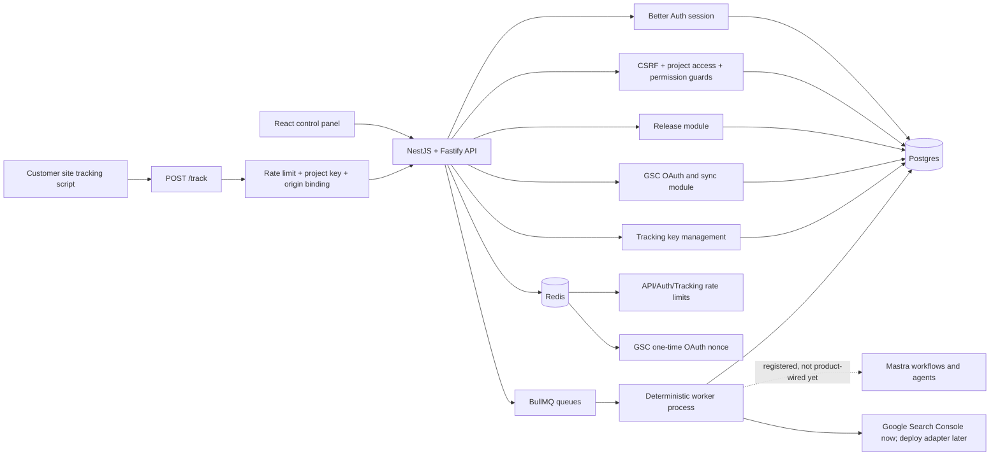
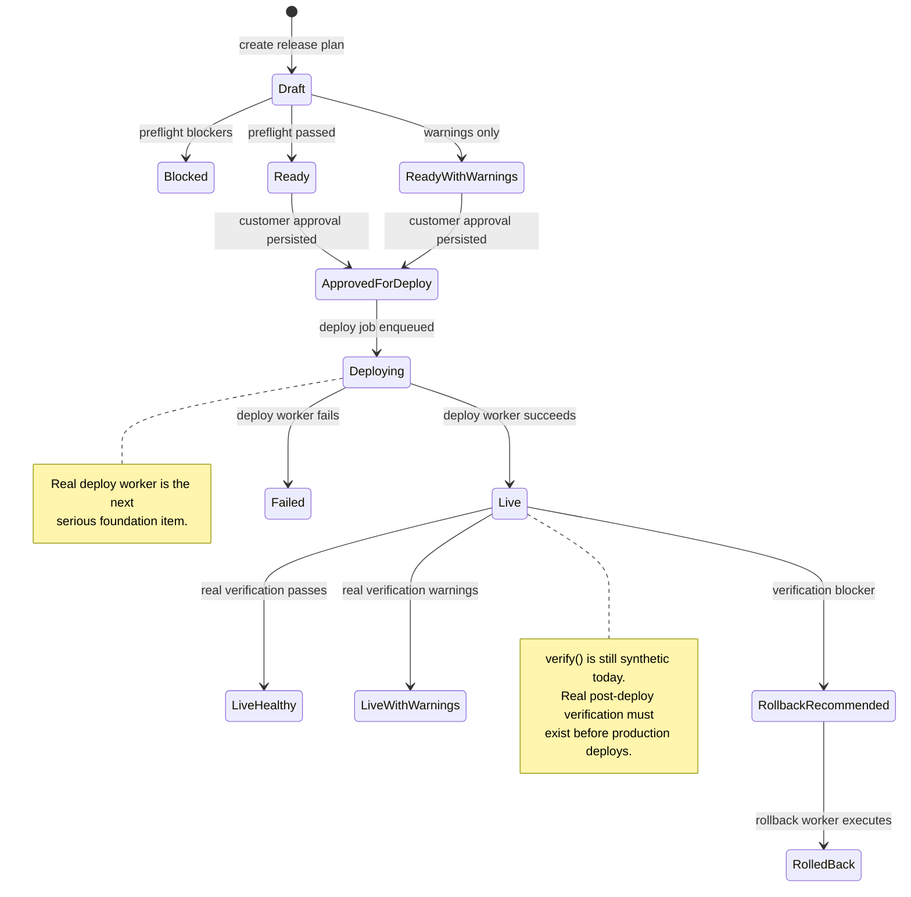

# Backend Foundation Status

Current baseline: after the backend hardening cleanup that followed `e66e1a9` (`Productionize tracking release and worker foundations`).

This page records what the backend foundation now enforces, what is still intentionally incomplete, and where the next serious foundation items sit on the roadmap.

## Current Foundation



How to read this: the API owns request authorization and persistence. The public tracking endpoint is not session guarded; its boundary is project-scoped publishable key plus allowed origin plus route-specific rate limiting. Workers execute queued side effects and now update `job_runs`.

## Finished

| Area                      | Status                      | What is enforced                                                                                                                                                                                 |
| ------------------------- | --------------------------- | ------------------------------------------------------------------------------------------------------------------------------------------------------------------------------------------------ |
| Auth/session              | Finished foundation         | Better Auth owns sessions, sessions are DB-durable, Fastify mounts `/api/auth/*`, Nest guards consume session context.                                                                           |
| Tenant authorization      | Finished foundation         | Project access resolves before permissions; owner/admin/editor/viewer roles gate privileged actions.                                                                                             |
| CSRF                      | Finished foundation         | Unsafe authenticated routes are Origin/Referer guarded outside local/test fallback.                                                                                                              |
| GSC OAuth                 | Finished foundation         | Signed state, PKCE, Redis `GETDEL` nonce, session re-check, project access re-check, encrypted token storage, safe redirect.                                                                     |
| DB ownership              | Finished foundation         | API process uses a shared `DatabaseService` and an executable no-rogue-pool guard.                                                                                                               |
| Redis ownership           | Finished foundation         | API process uses shared error-handled Redis for rate limits/OAuth state/Better Auth secondary storage.                                                                                           |
| Proxy/rate-limit topology | Finished foundation         | Broad `TRUST_PROXY=true` is rejected in production; Redis-backed rate limits are wired.                                                                                                          |
| Tracking ingestion        | Finished pre-MVP foundation | Per-project publishable keys, hashed storage, create/list/revoke API, owner/admin management, allowed-origin binding, `/track` IP and project rate limits, explicit dry-run vs persisted result. |
| Release preflight         | Finished pre-MVP foundation | Preflight reads persisted evidence and fails closed for missing approval, noindex, local SEO blockers, or rollback point. QA warnings and tracking readiness are warning-level.                  |
| Worker audit lifecycle    | Finished baseline           | Producers create `job_runs` before enqueue, workers prefer `jobRunId` payloads, and jobs mark running, completed, or failed for real BullMQ jobs.                                                |
| Frontend auth UX          | Finished baseline           | Login/sign-up/sign-out, session gate, credentialed API fetches, explicit local scaffold bypass.                                                                                                  |
| Mastra slot               | Reserved baseline           | `@localseo/ai` is registered with workflow/agent descriptors, but the product workflows for site planning and creative assembly are not integrated yet.                                          |

## Release Flow State



How to read this: the preflight and approval side is now real enough to trust as a gate. The deploy and verify side is not yet production-complete. Production deploys must remain blocked until those two notes are resolved.

## Next Serious Foundation Items

### 1. Deterministic Deploy Worker

Meaning: implement the real worker for `deploy` queue jobs. This worker should not rely on AI reasoning during execution.

Required behavior:

- Load the release plan, release items, checks, approval, and rollback evidence from Postgres.
- Re-check `canDeployRelease(plan, checks)` in the worker before mutating any hosting provider.
- Use a `SiteHostingPort` with a Netlify adapter or equivalent provider adapter.
- Publish only approved page versions.
- Inject/verify the project tracking snippet only from approved tracking config.
- Create or validate rollback artifacts before productive mutation.
- Persist deployment records and update release/deployment status truthfully.
- Be idempotent by release plan/deployment key so retries do not duplicate deploys.
- Update `job_runs` with a direct audit link, ideally via `jobRunId` in the BullMQ payload.

Definition of done:

```text
approved_for_deploy + passing checks
-> queued deploy job
-> deterministic worker executes hosting mutation
-> deployment row persisted
-> release status reflects actual side effect
```

### 2. Real Post-Deploy Verification

Meaning: replace the current synthetic `verify()` response with deterministic checks against live deployment evidence.

Required behavior:

- Fetch each intended live route.
- Check HTTP success status.
- Confirm live pages are not blocked by `noindex`.
- Check canonical URL and trailing slash expectations.
- Parse structured data enough to catch invalid JSON-LD/schema output.
- Confirm sitemap readiness/publication state when relevant.
- Confirm tracking script loads where tracking is configured.
- Persist `release_verifications` and update deployment verification status.
- Return `live_healthy`, `live_with_warnings`, or `rollback_recommended` only from real evidence.

Definition of done:

```text
deployed release
-> live route checks
-> persisted verification row
-> deployment/release status updated from evidence
-> rollback recommended when blockers exist
```

### 3. Foundation Integration Coverage

Meaning: prove the assembled foundation through API/DB/worker paths rather than isolated unit tests.

High-value items:

- API/DB-backed tracking ingestion tests for valid key, revoked key, wrong origin, malformed IDs, and route limit behavior.
- Release state-machine tests for create, preflight, approve, deploy queueing, cross-project rejection, and non-approvable statuses.
- Worker audit tests proving `jobRunId` lifecycle updates, enqueue-failure audit failure, and zero-row warnings.
- GSC sync retry test proving delete+insert analytics mutation is transactional.
- Login/session browser smoke for unauthenticated redirect, sign-in, protected route access, and sign-out.

## Mastra Reasoning And Creative Assembly Lane

Mastra is a first-class product lane, but it is not the production side-effect authority.

```mermaid
flowchart LR
  Import[Website import and field facts] --> Facts[Structured brand, service, area, design facts]
  Facts --> Mastra[Mastra reasoning workflows and agents]
  Mastra --> Proposal[Structured proposals]

  Proposal --> Contracts[Zod output contracts]
  Contracts --> Registry[Component registry and prop schemas]
  Registry --> QA[Deterministic SEO/design QA]
  QA --> Preview[Preview and edit UI]
  Preview --> Approval[Human/customer approval]
  Approval --> Release[Release preflight]
  Release --> Worker[Deterministic deploy worker]

  Mastra -. never directly deploys .-> Worker
```



How to read this: Mastra proposes strategy, content, layout, and design choices. Contracts, registries, deterministic QA, preview, approval, and workers decide what is valid and what is allowed to mutate production.

### Mastra Lane Status

| Slice                             | Status  | Purpose                                                                                                                           |
| --------------------------------- | ------- | --------------------------------------------------------------------------------------------------------------------------------- |
| AI reasoning port                 | Planned | Define the application interface for invoking Mastra without leaking agent/provider details into controllers or core packages.    |
| Website understanding workflow    | Planned | Convert imported website evidence into structured business, service, area, tone, color, layout, and CTA facts.                    |
| Component registry                | Planned | Define which frontend/site components Mastra may choose, including prop schemas and allowed style/theme tokens.                   |
| Page proposal workflow            | Planned | Produce route, page purpose, sections, component props, draft copy, metadata, schema, FAQ, CTA, and internal-link suggestions.    |
| Validation pipeline               | Planned | Validate every Mastra output with Zod, component prop schemas, local SEO QA, duplicate/cannibalization checks, and policy guards. |
| Preview and approval UI           | Planned | Render structured proposals for editing, notes, and persisted approval before release.                                            |
| Release/report narrative workflow | Planned | Draft release notes and customer-safe report language; deterministic guards block forbidden proof claims.                         |

### Mastra Can Suggest

- main-domain and subdomain/local-page structure,
- service/area page strategy,
- page hierarchy and internal links,
- component/section composition,
- copy for main-domain and local pages,
- title/meta/schema/FAQ/CTA drafts,
- design tone, colors, and theme hints from the imported website,
- release explanations,
- customer-safe report narrative.

### Mastra Must Not Own

- customer approval,
- release status truth,
- deploy execution,
- rollback execution,
- live health verification,
- direct provider/hosting mutations,
- unvalidated arbitrary frontend code generation.

Preferred output shape:

```text
website facts
-> Mastra structured proposal
-> schema/component validation
-> deterministic QA
-> preview
-> approval
-> release/deploy/verify
```

The key implementation rule is: Mastra outputs structured proposals, not arbitrary React/site code strings.

## Backend Foundation Readiness

Programming-wise, the backend foundation is set for continued product build and architecture review. The core security and tenancy surfaces are no longer scaffolding:

- session identity is real,
- tenant authorization is real,
- GSC OAuth is real,
- tracking ingestion has a real boundary,
- release preflight is evidence-backed,
- DB/Redis ownership is consolidated,
- worker jobs have baseline lifecycle audit.

It is not yet set for production deploys. The two load-bearing missing pieces are the deterministic deploy worker and real post-deploy verification. The Mastra creative assembly lane is also not product-integrated yet; it is planned as the proposal layer for site strategy, copy, layout, and design, not as an execution bypass. Until deploy and verification are done, deploy success and live health must not be treated as customer-safe production facts.

## Pattern Mining Checkpoint

A targeted pattern-mining run makes sense now, after the foundation has a concrete shape. The useful research question should be narrow:

```text
How do production TypeScript web apps wire:
- Next.js or React frontends,
- Fastify or Nest/Fastify APIs,
- queue workers,
- DB-backed audit/status rows,
- deploy/release verification flows,
- public browser tracking keys,
- Mastra-style reasoning workflows that produce structured site/content/layout proposals?
```

Best sources are likely official docs and close production repos, not broad big-data catalogs. The strongest comparison targets are apps with:

- a React/Next.js control plane,
- an API/worker split,
- provider adapters,
- job audit tables,
- deployment or publishing flows,
- public ingestion keys or webhook-style trust boundaries.
- AI/agent proposal workflows separated from deterministic execution.

The goal is not to reopen product decisions. The goal is to validate the remaining foundation items before implementing deploy, verification, and the Mastra proposal pipeline.
