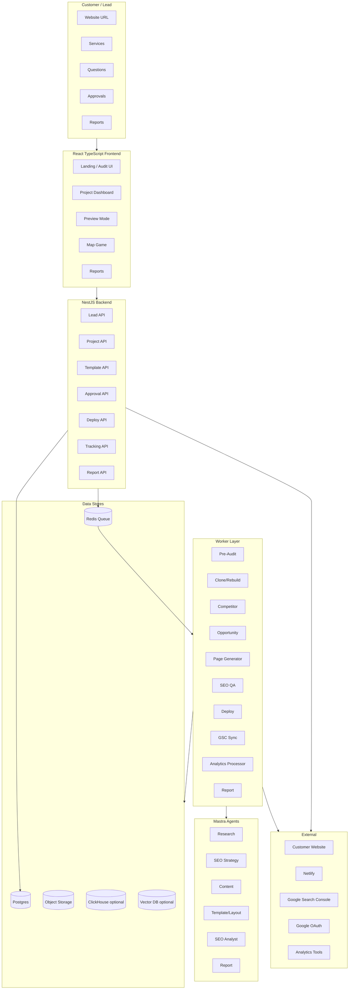

# System Overview

## Hauptsysteme

```text
Frontend: React/TypeScript + TanStack
Backend: NestJS API
Workers: Queue-basierte Job-Verarbeitung
AI Agents: Mastra Workflows/Agents
Data: Postgres, Redis, Object Storage, optional ClickHouse/Vector DB
External: Netlify, Google Search Console, Google OAuth, Analytics Tools
```

## Systemdiagramm



## Architekturprinzip

```text
Frontend macht Kontrolle sichtbar.
Backend orchestriert und schützt Business-Logik.
Workers machen schwere Arbeit asynchron.
AI Agents analysieren, schreiben, beraten.
Deploy/Tracking/Monitoring schließen den Loop.
```
