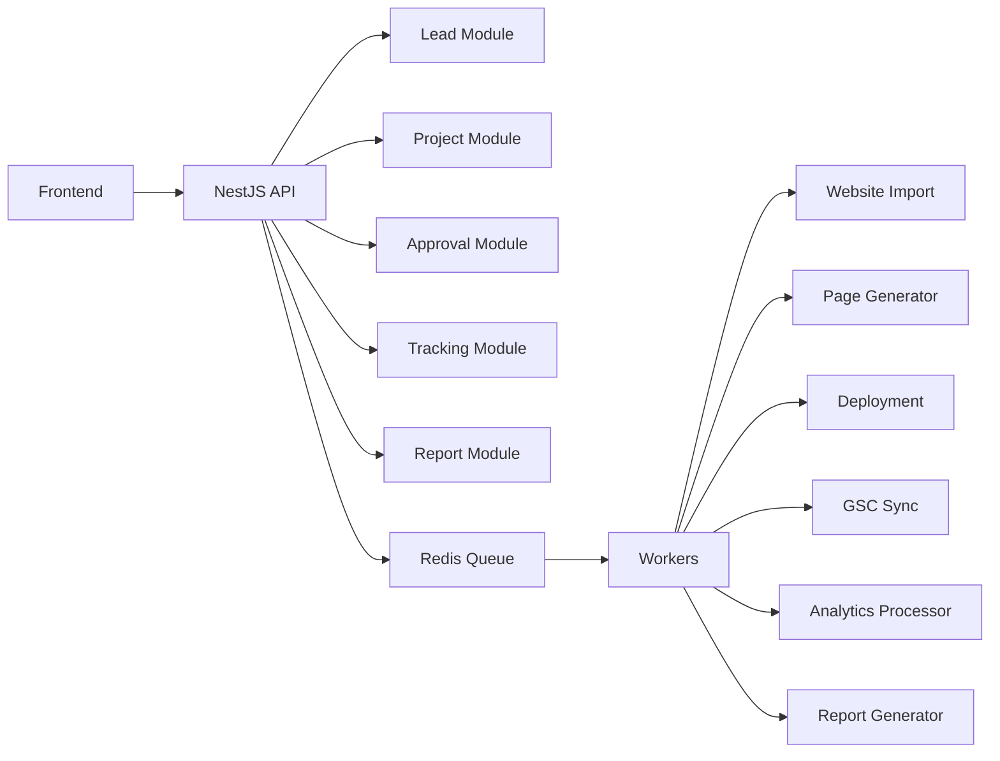

# Service Boundaries

## Module

```text
Lead Module
Project Module
Website Import Module
Template Module
Area/Service Module
Opportunity Module
Page Proposal Module
Approval Module
Deployment Module
GSC Module
Tracking Module
Report Module
Gamification Module
Billing/Plan Module
```

## Boundary Rules

<absolute-constraints>
- Frontend darf keine Worker direkt aufrufen.
- Worker dürfen Deploys nur für approved Versionen ausführen.
- AI Agents dürfen nicht direkt produktiv deployen.
- Tracking darf keine sensiblen Formularwerte speichern.
- GSC Tokens müssen verschlüsselt gespeichert werden.
- Preview URLs müssen noindex sein.
- Competitor Daten dürfen als Analyse genutzt werden, nicht als Copy-Quelle.
</absolute-constraints>

## Service Map


