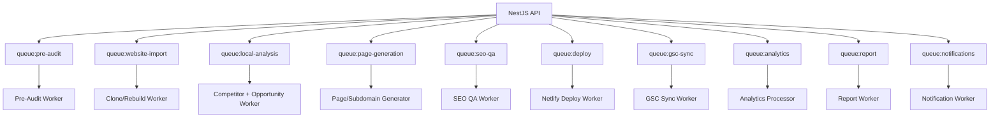

# Worker Architecture

## Queue Topology



## Worker Responsibilities

```text
Pre-Audit Worker:
- scannt Lead Website, Services, Konkurrenz, Orte
- erzeugt Potenzialbericht

Clone/Rebuild Worker:
- crawlt eigene Website des Kunden
- extrahiert Layout/Assets/Content
- erzeugt React/Vite Projekt
- verbessert UX/SEO/Performance

Competitor + Opportunity Worker:
- scannt schwere/einfache Konkurrenten
- findet easy/hard Orte
- baut Ort-Service-Matrix

Page Generator:
- wählt Template/Components
- erzeugt Page JSON und Versionen
- verarbeitet Kundennotizen

SEO QA Worker:
- prüft Technik, Similarity, Canonicals, Sitemap, noindex, Qualität

Deploy Worker:
- baut approved Versionen
- pushed Netlify
- setzt Domain/Subdomain/Routing

GSC Sync Worker:
- holt Queries, Pages, Clicks, Impressions, CTR, Position

Analytics Processor:
- verarbeitet page_view, scroll, CTA, phone, whatsapp, forms

Report Worker:
- erstellt Lagebericht, Map, Bundles, Empfehlungen
```
