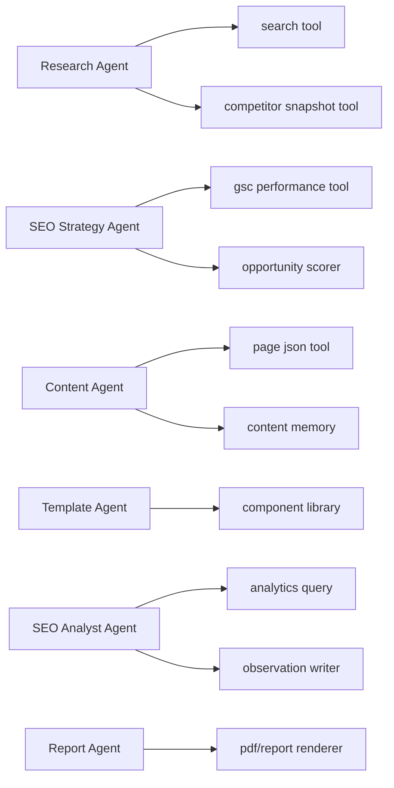

# AI Agent Architecture

## Mastra Modell

Deterministische Prozessketten sind Workflows. Offene Analyse-/Beratungsaufgaben sind Agents.

## Agents

```text
Research Agent:
- findet SERP-/Wettbewerber-/Branchenmuster

SEO Strategy Agent:
- bewertet Orte, Services, Keywords, Konkurrenz

Content Agent:
- schreibt lokale Texte, FAQs, Meta Titles, CTAs

Template/Layout Agent:
- wählt Components und Layoutvarianten

SEO Analyst Agent:
- erklärt Daten, speichert Beobachtungen, schlägt Aktionen vor

Report Agent:
- erstellt Lageberichte, Kundenreports, catchy Copy
```

## Agent-Tool Map



## Agent Safety

<absolute-constraints>
- Agents dürfen keine Deploys ohne Approval triggern.
- Agents dürfen keine Kundenentscheidung vortäuschen.
- Agents dürfen keine Google-Rankings garantieren.
- Agents dürfen Wettbewerber nicht kopieren.
- Agents müssen Unsicherheit/Confidence sichtbar machen.
</absolute-constraints>
