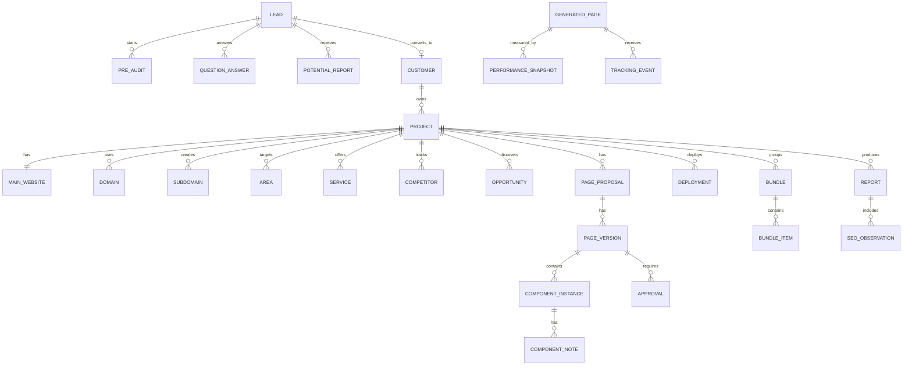

# Data Model

## Core ERD



## Key Tables

```text
leads
pre_audits
potential_reports
customers
projects
main_websites
domains
subdomains
areas
services
competitors
opportunities
page_proposals
page_versions
component_templates
component_instances
component_notes
approvals
deployments
gsc_connections
performance_snapshots
tracking_events
seo_observations
bundles
bundle_items
experiments
experiment_results
reports
```

## Bundle Items

```text
bundle_items:
- keyword
- city
- service
- page_id
- current_position
- target_position
- impressions
- clicks
- ctr
- opportunity_score
- estimated_value
```
