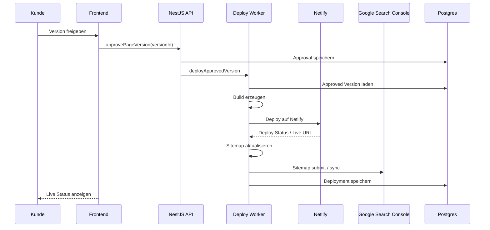

# Deployment, Netlify and GSC

## Deployment Flow



## Deployment Regeln

<absolute-constraints>
- Keine nicht freigegebene Version deployen.
- Keine Staging URLs indexierbar lassen.
- Keine alten URLs ohne Redirect vergessen.
- Keine Sitemap mit Draft/noindex Seiten füllen.
- Keine Canonicals auf Preview Domains setzen.
</absolute-constraints>

## Netlify Struktur

```text
main website:
kunde.de

local subdomains:
dachau.kunde.de
petershausen.kunde.de

staging:
project-id--preview.netlify.app = noindex
```
