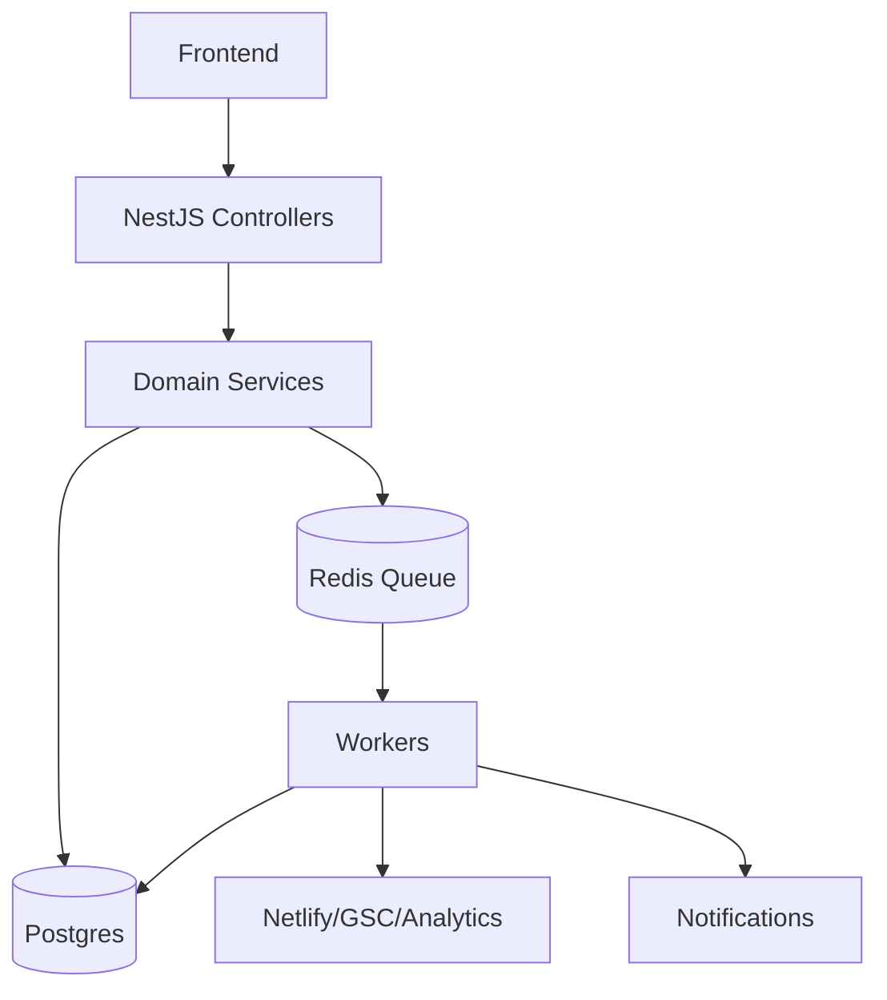

# Backend Architecture

## NestJS Module

```text
LeadModule
PreAuditModule
ProjectModule
WebsiteImportModule
TemplateModule
ComponentModule
AreaServiceModule
OpportunityModule
PageProposalModule
ApprovalModule
DeploymentModule
GscModule
TrackingModule
AnalyticsModule
ReportModule
GamificationModule
NotificationModule
BillingModule
```

## API Principles

```text
- Every long-running task returns jobId.
- Frontend polls or subscribes to job state.
- Every deployable artifact is versioned.
- Every customer decision is auditable.
- Workers are idempotent where possible.
- Failures are explicit, not silent.
```

## Backend Flow


