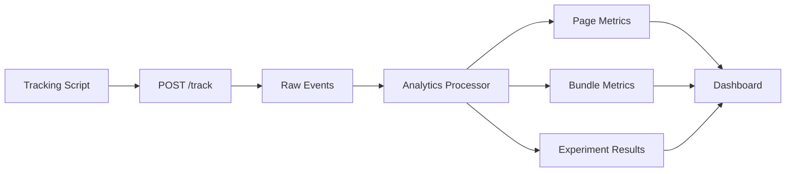

# Tracking Event Design

## Minimal Tracking Script

Das Tracking Script läuft auf deployten Kunden-Websites und sendet an `POST /track`.

## Event Schema

```json
{
  "projectId": "project_123",
  "pageId": "page_123",
  "sessionId": "anon_session",
  "event": "phone_click",
  "path": "/dachau/flachdachsanierung",
  "device": "mobile",
  "ts": "2026-06-19T10:00:00.000Z",
  "meta": {
    "ctaId": "sticky-phone"
  }
}
```

## Event Types

```text
page_view
scroll_25
scroll_50
scroll_75
scroll_90
time_30_seconds
cta_visible
cta_click
phone_click
whatsapp_click
email_click
form_start
form_submit
map_click
faq_open
gallery_open
service_card_click
```

## Analytics Processing


