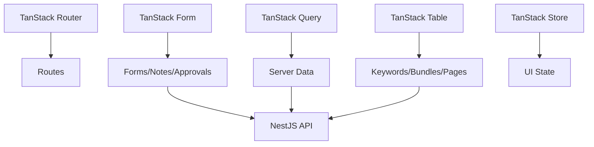

# Frontend Architecture

## Ziel

Das Frontend ist das Kontrollzentrum. Der Kunde soll spüren: Automation arbeitet, aber ich entscheide.

## Stack

```text
React
TypeScript
TanStack Router
TanStack Query
TanStack Form
TanStack Table
TanStack Store optional
TanStack Virtual optional
Mermaid/React renderer für Diagramme
MapLibre/D3/React Flow für Map
```

## Routes

```text
/
/audit
/audit/:leadId/report
/projects/:projectId
/projects/:projectId/website
/projects/:projectId/areas
/projects/:projectId/opportunities
/projects/:projectId/pages
/projects/:projectId/pages/:pageId/preview
/projects/:projectId/approvals
/projects/:projectId/performance
/projects/:projectId/map
/projects/:projectId/bundles
/projects/:projectId/reports
```

## UX Layout

```text
Top: Projektstatus + nächste Aktion
Left: Navigation / Map / Sections
Center: Preview / Tabelle / Report / Map
Right: Analyst Panel / Decision Panel
Bottom: Worker Timeline / Activity Feed
```

## Frontend State


