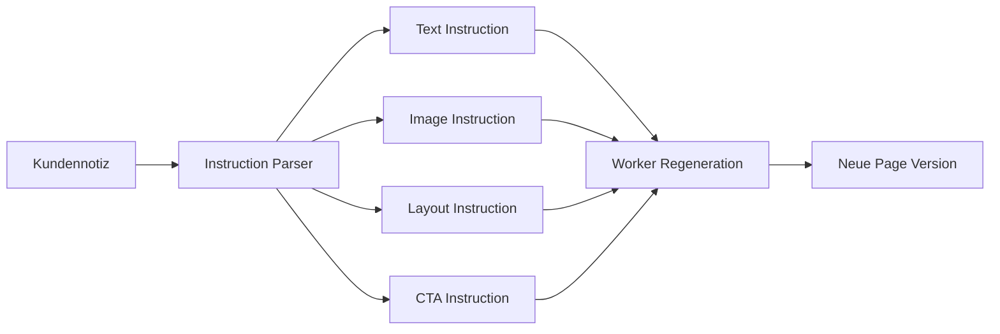

# Preview and Notes UX

## Vorzeigemodus

Der Kunde sieht die Seite wie live. Klickt er auf eine Section, öffnet sich rechts ein Panel.

## Panel-Funktionen

```text
- Component wechseln
- Variante wählen
- Textnotiz schreiben
- Bilderwunsch schreiben
- CTA ändern
- Reihenfolge ändern
- Tonalität angeben
- SEO-Hinweis sehen
- Regenerate Preview
- Approve Version
```

## Beispiel UI

```text
┌───────────────────────────────────────────────┬──────────────────┐
│ Preview: dachau.kunde.de/flachdachsanierung   │ Analyst / Editor │
├───────────────────────────────────────────────┼──────────────────┤
│ [Hero Component]                              │ Selected: Hero   │
│ Flachdachsanierung in Dachau                  │ Variant: Premium │
│ Jetzt anrufen                                 │ Note: Mehr ...   │
│                                               │ [Regenerate]     │
│ [Service Cards]                               │ [Approve]        │
│ [Gallery]                                     │                  │
│ [FAQ]                                         │                  │
└───────────────────────────────────────────────┴──────────────────┘
```

## Notizen als Instructions


