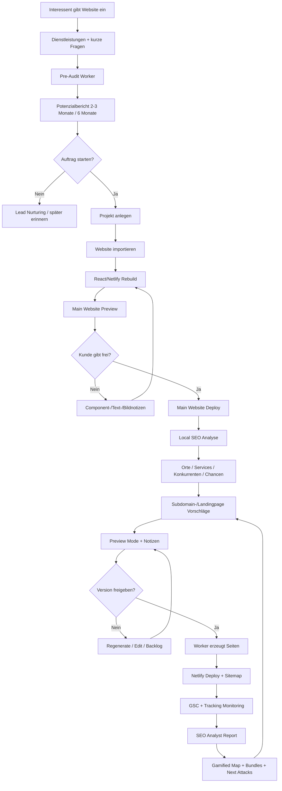

# End-to-End Product

## Produktidee

Die Plattform automatisiert eine lokale SEO-Agenturleistung, aber mit Kundenerlebnis wie ein kontrolliertes Strategiespiel. Der Kunde sieht Potenziale, Rankings, Orte, Wettbewerber, Bundles, Reports und vorgeschlagene Updates. Er kann freigeben, bearbeiten, pausieren oder ablehnen.

## Komplettloop



## Was der Kunde bekommt

- Vor dem Auftrag: Potenzialbericht, Umsatzchance, realistische Zeitachsen.
- Während des Projekts: Website Preview, Komponenten-Auswahl, Notizen, Freigaben.
- Nach dem Deploy: Rankings, Klicks, Seitenperformance, Map, Bundles, Updates.
- Wiederkehrend: ehrliche Analyst-Berichte, Gewinn-/Problemkarten, nächste Aktionen.

## Was das Produkt nicht ist

<absolute-constraints>
- Es ist kein blindes SEO-Massenpublishing.
- Es ist kein Wettbewerber-Kloner.
- Es ist kein WordPress-Builder mit beliebigem Chaos.
- Es ist kein Dashboard, das nur trockene Zahlen zeigt.
- Es ist kein System, das immer grüne Fake-Erfolge zeigt.
</absolute-constraints>

## Was das Produkt sein soll

```text
Ein kontrolliertes, automatisiertes Local-SEO-Wachstumssystem.
Kunde fühlt Kontrolle.
Agent liefert Beratung.
Worker liefern Umsetzung.
Reports liefern Motivation.
Map liefert Spielgefühl.
Daten liefern Glaubwürdigkeit.
```
