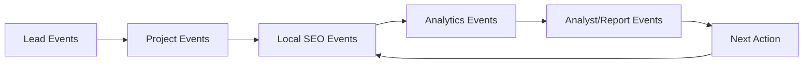

# Domain Events

Diese Events beschreiben das Produkt als Event-Storming-Modell.

## Lead Events

```text
LeadCreated
WebsiteUrlSubmitted
ServicesSubmitted
LeadQuestionsAnswered
PreAuditQueued
PreAuditStarted
WebsiteScanCompleted
CompetitorScanCompleted
LocalPotentialCalculated
PotentialReportGenerated
PotentialReportViewed
OfferRequested
SalesCallBooked
LeadConvertedToCustomer
```

## Project Events

```text
ProjectCreated
DomainConnected
GscConnected
NetlifyConnected
MainWebsiteImportStarted
MainWebsiteImportCompleted
ReactRebuildGenerated
MainPreviewGenerated
CustomerNoteAdded
MainWebsiteApproved
MainWebsiteDeployed
```

## Local SEO Events

```text
AreaMatrixGenerated
ServiceMatrixGenerated
CompetitorDifficultyCalculated
OpportunityCreated
OpportunityBundled
PageProposalCreated
PageVersionGenerated
PageVersionApproved
SubdomainBuildQueued
SubdomainDeployed
SitemapUpdated
UrlInspectionQueued
```

## Analytics Events

```text
GscPerformanceSynced
PageClickDetected
PhoneClickDetected
WhatsappClickDetected
FormSubmitted
ScrollDepthReached
EngagementWindowCompleted
ExperimentStarted
ExperimentResultCalculated
```

## Analyst/Report Events

```text
SeoObservationCreated
GoodSignalDetected
WeakSignalDetected
CompetitorOvertaken
KeywordReachedTop10
KeywordReachedTop3
KeywordReachedPosition1
ReportGenerated
NextActionSuggested
CustomerApprovedNextAction
RenewalMomentCreated
```

## Event Flow


