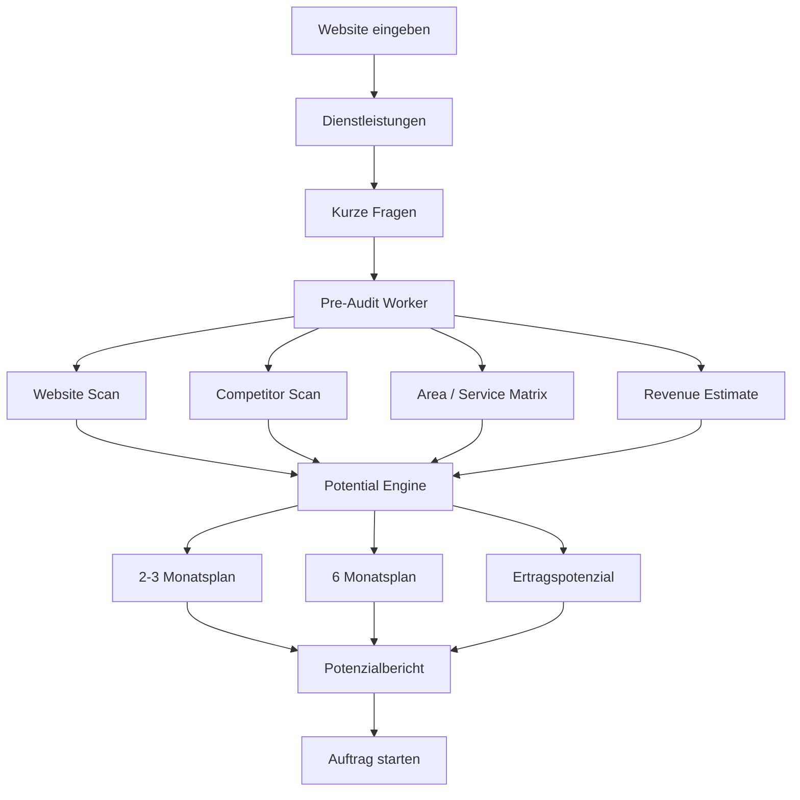

# Pre-Sales Potential Report

## Zweck

Bevor ein Kunde einen Auftrag erstellt, gibt er Website, Dienstleistungen und kurze Antworten ein. Daraus erstellt der Worker einen Potenzialbericht für die nächsten 2–3 Monate und das nächste halbe Jahr.

## Lead Input

```text
- Website URL
- Unternehmensname
- Branche
- Dienstleistungen
- Einzugsgebiet
- Zielorte / Ausschlussorte
- durchschnittlicher Auftragswert
- monatliche Kapazität
- wichtigste Leistung
- Bild-/Referenzmaterial vorhanden?
- Google Business Profile vorhanden?
- bestehende Website zufriedenstellend?
```

## Worker Output

```text
- aktuelle Website-Ausgangslage
- technische SEO-Lücken
- lokale SEO-Lücken
- Konkurrenzstärke je Ort
- easy-to-win Orte
- hard/boss-level Orte
- 2-3 Monats Quick Wins
- 6 Monats Ausbauplan
- geschätzte Leads/Klicks/Umsatz
- empfohlenes Startpaket
```

## Flow



## Report Copy

```text
In den nächsten 2–3 Monaten sehen wir realistische Chancen auf erste Sichtbarkeit bei einfachen lokalen Suchbegriffen.
Im 6-Monats-Zeitraum kann daraus ein regionales SEO-Netz aus mehreren Orten und Dienstleistungen entstehen.
```

## Forecast Ethik

<absolute-constraints>
- Keine garantierten Platz-1-Versprechen.
- Keine künstlich erfundenen Umsatzzahlen.
- Keine manipulative Sicherheit vortäuschen.
- Konservative Schätzbereiche sind erlaubt.
- Unsicherheit muss als Confidence sichtbar sein.
</absolute-constraints>
