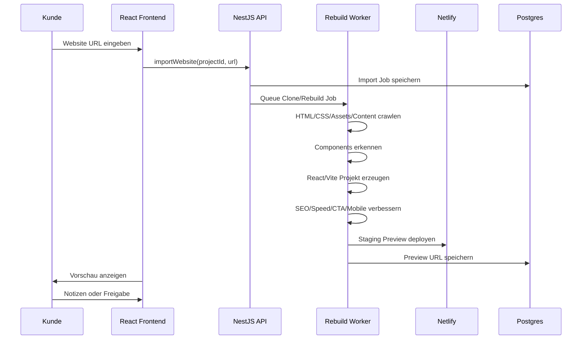

# Main Website Rebuild

## Kernidee

Der Kunde gibt seine eigene bestehende Website ein. Das System importiert sie, rekonstruiert sie als moderne React/TypeScript Website, verbessert sie und deployed sie auf Netlify.

## Nicht nach außen sagen

```text
Wir klonen deine Website.
```

## Besser nach außen sagen

```text
Wir bauen deine bestehende Website als schnelle, moderne SEO-Version neu auf, behalten deine Marke bei und verbessern sie für lokale Anfragen.
```

## Ablauf



## Verbesserungen

- Mobile First
- schnelle Ladezeit
- klare CTAs: Telefon, WhatsApp, Formular
- strukturierte H1/H2
- bessere Meta Titles/Descriptions
- LocalBusiness/Service Schema
- noscript/static fallback für Crawlability
- Bilder komprimieren und Alt-Texte
- Redirects für alte URLs
- Sitemap und robots.txt

## Staging-Regel

Preview-/Staging-Seiten dürfen nicht indexiert werden.

```html
<meta name="robots" content="noindex,nofollow">
```
