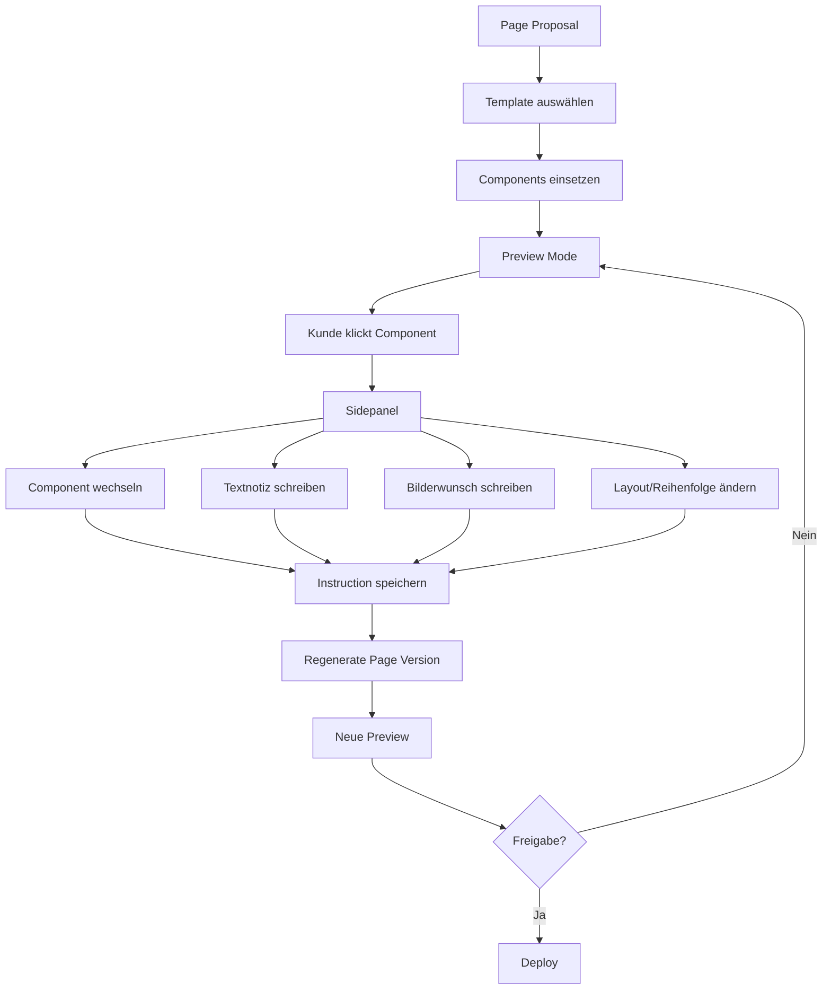

# Template Component Preview System

## Idee

Der Kunde bekommt keinen freien Website-Builder, sondern einen kontrollierten Vorzeigemodus. Er sieht Seiten/Subdomains aus euren Components, kann Varianten wählen, Notizen schreiben und konkrete Versionen absegnen.

## Component Library

```text
Hero
Service Grid
Trust / Bewertungen
Vorher-Nachher Galerie
Slideshow
Referenzen
FAQ
Kontakt CTA
Ortsteil-Liste
Leistungsbeschreibung
Problem-Lösung Block
Google Maps / Einzugsgebiet
Notdienst Banner
Footer
```

## Flow



## Page JSON Modell

```json
{
  "pageType": "local_subdomain",
  "target": {
    "city": "Dachau",
    "service": "Flachdachsanierung",
    "subdomain": "dachau.kunde.de"
  },
  "template": "premium-local-service",
  "components": [
    {
      "id": "hero_01",
      "type": "Hero",
      "variant": "HeroPremium",
      "props": {
        "headline": "Flachdachsanierung in Dachau",
        "ctaPrimary": "Jetzt anrufen"
      },
      "customerNotes": ["Mehr Premium, weniger Notdienst-Ton."]
    }
  ]
}
```

## Versioning-Regel

<absolute-constraints>
- Kunde gibt immer eine konkrete Page Version frei.
- Nach Freigabe wird nicht still dieselbe Version verändert.
- Neue Änderungen erzeugen neue Versionen.
- Deploy darf nur approved Versionen veröffentlichen.
</absolute-constraints>
