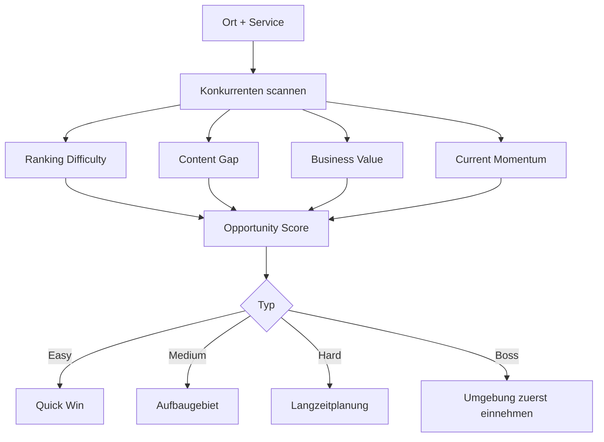

# Local SEO Engine

## Aufgabe

Die Engine findet lokale Chancen aus Kombinationen von Ort, Dienstleistung, Konkurrenz, Suchintention, Rankingstatus, Ertrag und Umsetzbarkeit.

## Matrizen

```text
Area Matrix:
- Orte
- Ortsteile
- Landkreise
- Radius
- Priorität
- Ausschlussgebiete

Service Matrix:
- Kernleistungen
- High-ticket Leistungen
- wiederkehrende Leistungen
- Notfallleistungen
- Cross-Sell Leistungen

Keyword Matrix:
- service + ort
- problem + ort
- notfall + ort
- markenlose Suchintention
- Wettbewerber-Kontext
```

## Schwierigkeitslogik



## Taktik-Beispiel

```text
Dachau = schwieriger Ort / langfristiger Angriff.
Heimhausen = schneller Ort / kann schnell erledigt werden.
Strategie: Umgebung gewinnen, regionale Relevanz aufbauen, dann Dachau stärker drücken.
```

## Scoring Faktoren

```text
opportunity_score =
  search_intent_score
+ business_value_score
+ current_visibility_score
+ competitor_weakness_score
+ local_relevance_score
+ content_gap_score
+ execution_effort_inverse
```
