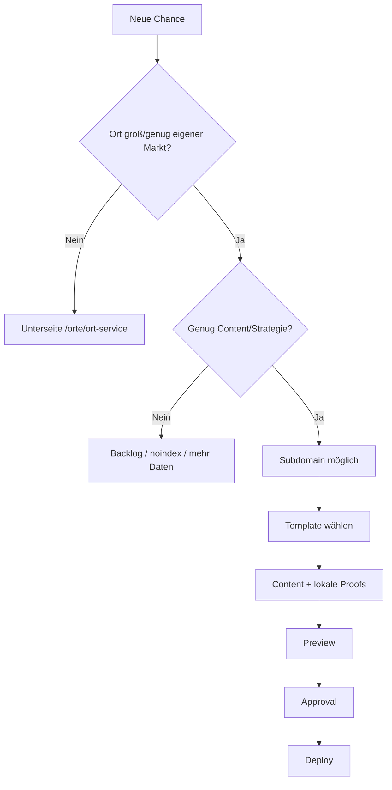

# Subdomains and Local Pages

## Idee

Subdomains und lokale Seiten werden aus eigenen Components/Templates erzeugt. Sie sollen sich unterschiedlich anfühlen und je Ort/Leistung anders aufgebaut sein.

## Entscheidungsmodell



## Beispiele

```text
Unterseite:
kunde.de/orte/petershausen/
kunde.de/leistungen/dachreparatur-dachau/

Subdomain:
dachau.kunde.de
pfaffenhofen.kunde.de
muenchen-nord.kunde.de
```

## Quality Gate

```text
- eigene lokale Inhalte
- eigener Suchintent
- echte Bilder/Referenzen/Proofs falls vorhanden
- klare interne Links
- sinnvolle CTA
- saubere Canonicals
- Sitemap nur bei publish-ready
```

## Produktregel

Templates sollen nicht Ähnlichkeit tarnen, sondern UX/Conversion verbessern.
