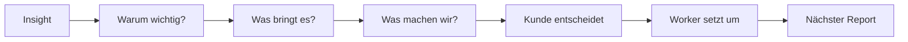

# SEO Reports as Decision Engine

## Prinzip

Der Report zeigt nicht nur Daten, sondern macht aus Daten Entscheidungen.

```text
Wo gewinnen wir?
Wo geht etwas hoch?
Wo sind wir kurz vor Top 3?
Wo ist ein schwieriger Markt?
Wo sollten wir bremsen?
Was soll der Kunde freigeben?
```

## Report-Struktur

```text
1. Lagebericht
2. Gewonnen: Platz 1 / Top 3
3. Momentum: Rankings gehen hoch
4. Angriff: Seite 1, aber noch Luft nach oben
5. Probleme: keine Daten / schwacher CTR / nicht indexiert
6. Bundles: gute Durchschnittswerte
7. Map: Gebiete gewonnen / in Angriff / noch offen
8. Aktionen: freigeben, bearbeiten, beobachten, pausieren
```

## Catchy Titel

```text
Dein Google-Lagebericht
Wo wir gewinnen — und wo wir jetzt angreifen
Dachau geht hoch: willst du nachdrücken?
Diese Suchbegriffe besitzen wir gerade
Kurz vor dem Durchbruch
```

## Report Flow



## Beispiel Report Cards

```text
🔥 Dachau geht hoch
Stark umkämpft, aber jetzt auf Seite 1.
Empfehlung: Dachau nicht stoppen. Erst Umgebung stärken, dann Dachau Richtung Top 3 drücken.
[Update-Vorschau] [Dachau ausbauen] [Beobachten]
```

```text
🏆 Gewinner-Bundle: Dach & Spengler
Ø Position: Top 5
Diese Leistung zieht stark. Empfehlung: Gewinner-Muster auf neue Orte übertragen.
[Ähnliche Chancen finden]
```

```text
🟡 Fast da
12 Keywords zwischen Position 4 und 10.
Mit gezielten Updates können aus sichtbaren Seiten echte Top-Positionen werden.
[Updates erstellen]
```
