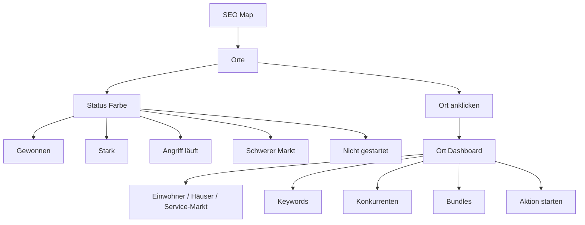
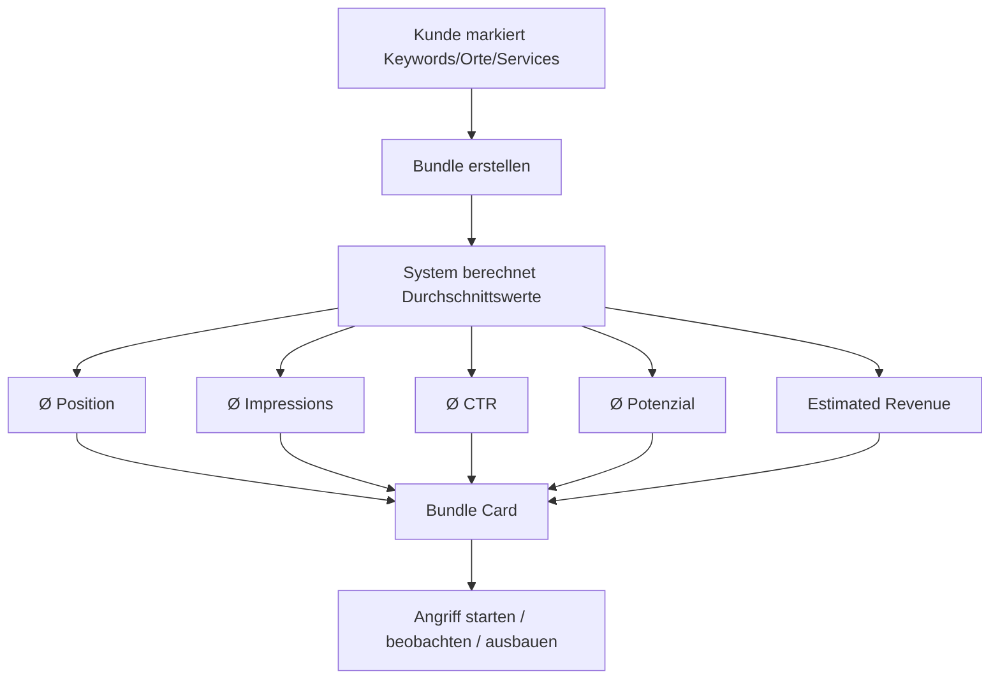

# Gamification, Dynamic Map and Bundles

## Idee

Der Kunde soll Spaß daran haben, Platz-1-Keywords, Top-3-Gebiete, neue Orte und überholte Konkurrenten zu sammeln. Das Spielgefühl ist wie eine strategische Expansion Map, aber visuell seriös und business-orientiert.

## Dynamic Map



## Gebietstaktik

```text
Dachau = Boss-Level / langfristiger Plan
Heimhausen = einfacher schneller Gewinn
Taktik = erst Umgebung einnehmen, dann Dachau stärker angreifen
```

## Achievements

```text
🏆 Platz-1-Sammler
🔥 Dachau-Angriff gestartet
🗺️ Neuer Ort erschlossen
⚔️ Konkurrent überholt
💰 High-Ticket-Keyword gewonnen
📈 Momentum erkannt
🧠 Smart Update freigegeben
```

## Bundles

Ein Bundle ist eine frei oder automatisch gruppierte Menge aus Keywords, Orten, Services oder Seiten. Der Kunde kann z. B. nur Dachdecker-Keywords bündeln, damit der Durchschnitt besser und sinnvoller ist als ein Gesamtmix aller Leistungen.

```text
Bundle: Dach & Spengler
Ø Position: Top 5
Platz-1-Keywords: 5
Top-3-Keywords: 15
Status: Gewinner-Bundle
```

## Bundle Builder Flow



## Automatische Good Bundles

Das System soll positive, sinnvolle Bundles vorschlagen und schlechte Durchschnitte nicht prominent machen.

```text
Score 85–100: Gewinner-Bundle
Score 70–84: Momentum-Bundle
Score 55–69: Ausbauchance
Score <55: intern behalten, nicht prominent zeigen
```

## Seriöser Rahmen

<absolute-constraints>
- Keine kindische Spielzeug-Optik.
- Keine manipulative Suchtmechanik.
- Keine fake Erfolge.
- Keine falschen Garantien.
- Business-Nutzen bleibt immer sichtbar.
</absolute-constraints>
