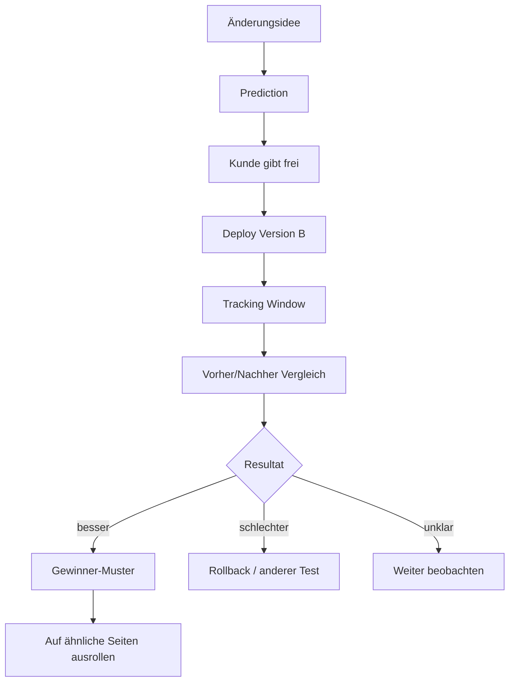

# Tracking, Experiments and Visitor Retention

## Ziel

Nicht nur Rankings messen, sondern verstehen, welche Änderungen Besucher länger halten und mehr Kontaktaktionen erzeugen.

## Messbare Events

```text
page_view
scroll_25
scroll_50
scroll_75
scroll_90
time_30_seconds
cta_visible
cta_click
phone_click
whatsapp_click
email_click
form_start
form_submit
gallery_open
faq_open
service_card_click
map_click
```

## Experiment Loop



## Was Besucher länger hält

```text
- Ort und Leistung sofort im Hero
- klares Problem + klare Lösung
- lokale Bilder und echte Referenzen
- Bewertungen/Proof vor langen Texten
- Sticky Telefon/WhatsApp CTA
- FAQ mit echten Fragen
- Galerie früh genug sichtbar
- klare Service Cards
- bessere Textlänge ohne generischen SEO-Brei
```

## Beispiel Analyst Report

```text
Update: Hero + WhatsApp Button auf Dachau-Seite verbessert.
Vorher: Ø 22 Sekunden, 31 % Scrolltiefe, 4 Telefon-Klicks.
Nachher: Ø 41 Sekunden, 58 % Scrolltiefe, 11 Telefon-Klicks.
Bewertung: Dieses Update hat Besucher länger gehalten und mehr Kontaktaktionen erzeugt.
```

## Später: A/B Testing

Start: Change Log + Vorher/Nachher.
Später: echte A/B Tests mit Version A/B und Signifikanz-/Confidence-Hinweis.
