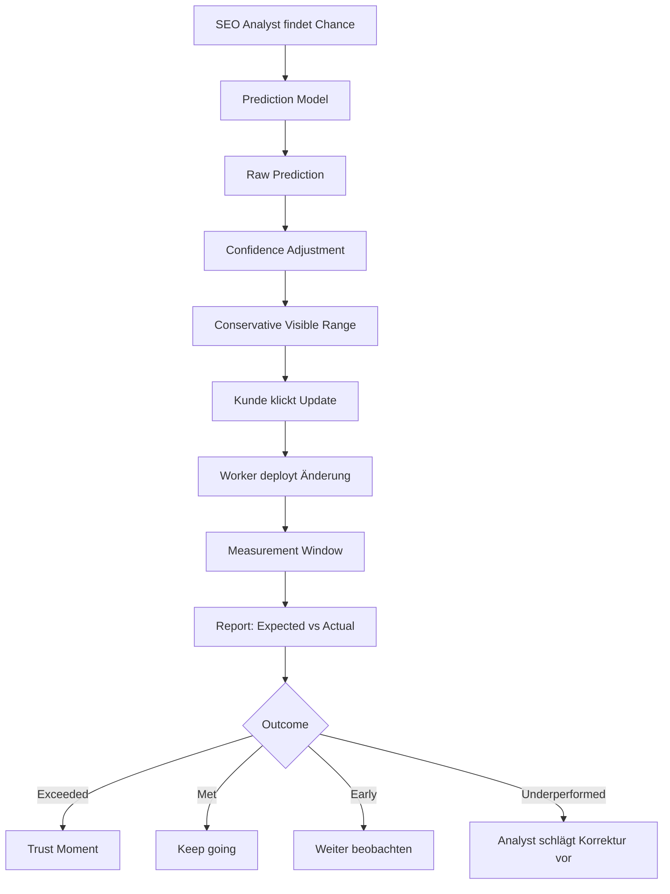

# Forecast and Renewal Loop

## Idee

Wenn genug historische Daten vorhanden sind, zeigt das Tool vor einem Update eine konservative Wirkungsschätzung. Nach dem Report wird die tatsächliche Performance verglichen.

## Saubere Version

```text
Raw Prediction intern: +18 % Sichtbarkeit
Customer Range sichtbar: +8–14 %
Actual später: +19 %
Report: Update performed above expectation
```

## Flow



## Ergebnis-Kategorien

```text
Exceeded expectation
Met expectation
Too early to judge
Underperformed
Failed / needs correction
```

## Regel

Konservativ schätzen ist gut. Fake senken oder manipulieren ist nicht erlaubt.
