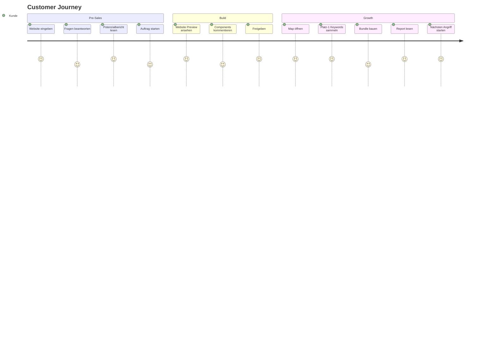

# Customer Experience

## Desired Feeling

Der Kunde soll das Gefühl haben, ein lokales Google-Gebiet strategisch aufzubauen.

```text
Ich sehe meine Chancen.
Ich sehe schwere und leichte Orte.
Ich sehe, welche Keywords ich schon besitze.
Ich sehe, wo Google uns testet.
Ich entscheide, wo wir drücken.
```

## UX Principles

```text
- Automation sichtbar machen, aber nicht beängstigend.
- Fortschritt als Timeline zeigen.
- Reports in Entscheidungen übersetzen.
- Schlechte Signale ehrlich zeigen.
- Kontrolle durch Preview + Approval.
- Gamification seriös verpacken.
- Jede Aktion erklärt: Warum, Nutzen, Aufwand, Risiko.
```

## Main Customer Journey


