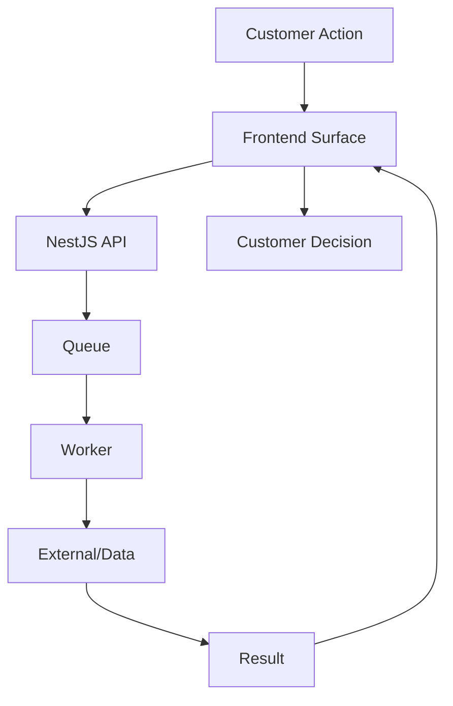

# Service Blueprint

| Phase | Kunde sieht | Frontend | Backend/Worker | Daten/Integrationen |
|---|---|---|---|---|
| Lead | URL + Fragen | Audit Form | Lead API | Lead DB |
| Analyse | Progress Timeline | Worker Status | Pre-Audit Worker | Website/Competitors |
| Bericht | Potential Report | Report UI | Report Worker | Opportunity Data |
| Auftrag | Projekt startet | Onboarding | Project API | Customer/Project |
| Website | Preview | Preview UI | Rebuild Worker | Netlify Staging |
| Freigabe | Notizen/Approve | Component Notes | Approval API | Versioned Pages |
| Deploy | Live Status | Deploy Status | Netlify Worker | Netlify/DNS |
| Wachstum | Map/Report/Bundles | Dashboard | GSC/Analytics Workers | GSC/Tracking |

## Blueprint Flow

